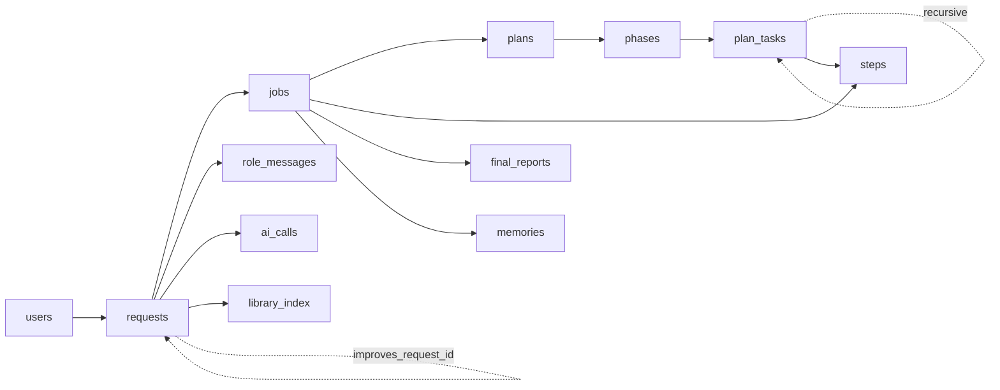
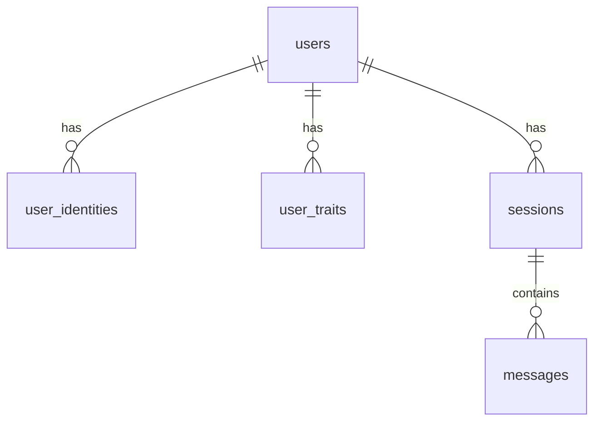
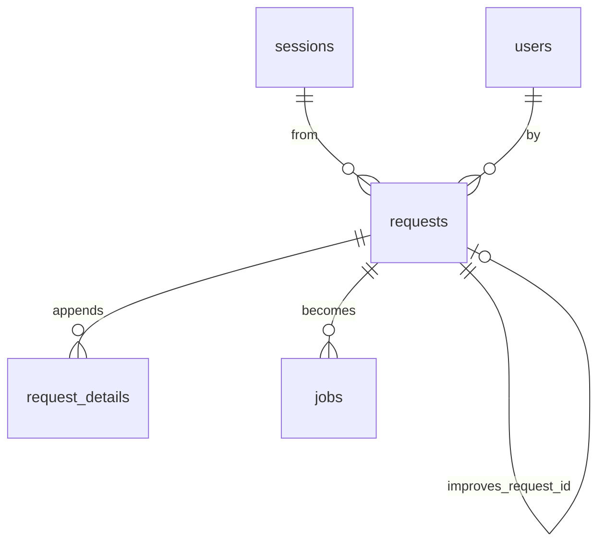
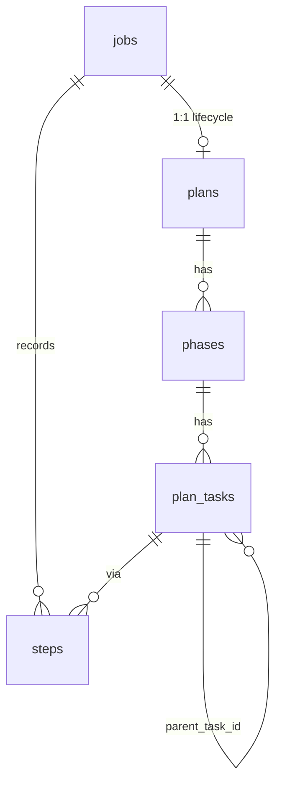
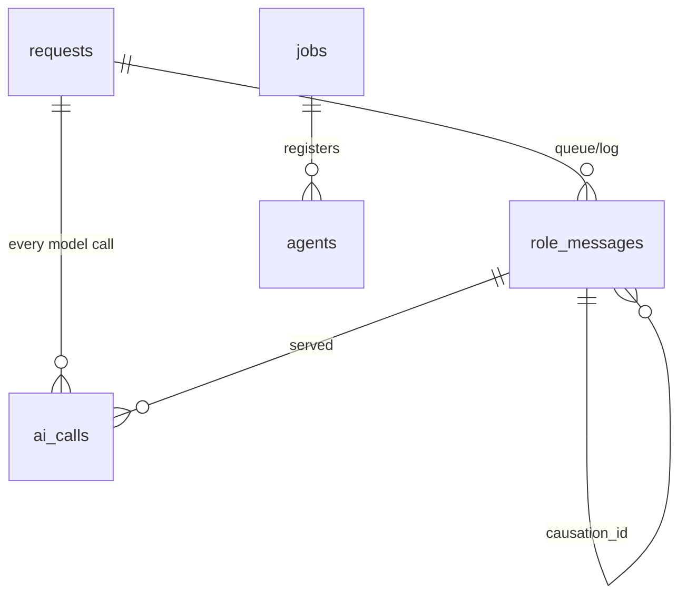
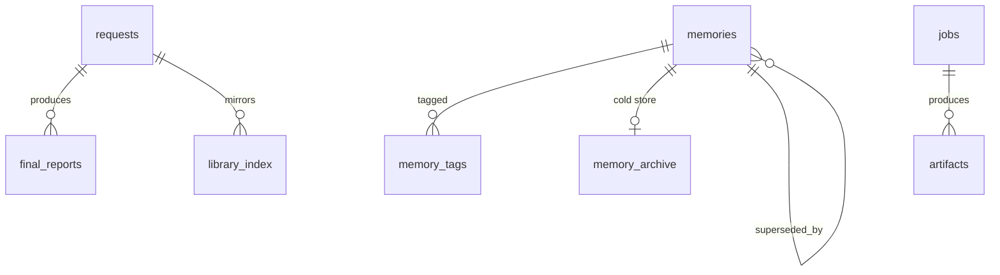
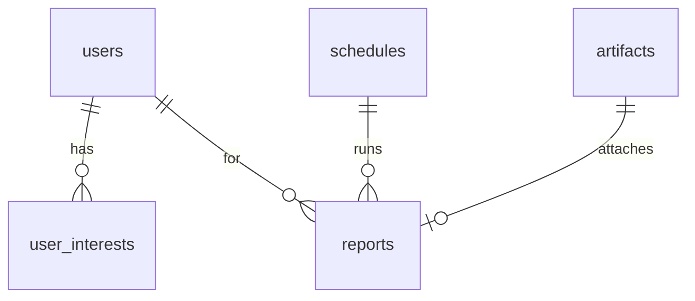

# Database Schema

The deterministic storage layer (design-spec §9). Pure SQLite, no AI — every
later phase persists here, and all state is recoverable from these tables plus
the on-disk library folders.

> Source of truth: the migration files in
> [backend/app/storage/migrations/](../backend/app/storage/migrations/). This
> document mirrors them; if they ever disagree, the SQL wins. Regenerate a live
> listing any time with `python -m app.cli.db --schema` (see §[Inspecting](#inspecting--migrating)).

---

## Conventions

- **Primary keys** are `INTEGER PRIMARY KEY` (SQLite rowid alias, autoincrementing).
- **Timestamps** are `TEXT` in UTC, defaulting to `datetime('now')` (SQLite has no
  native datetime type). Columns end in `_at`.
- **Booleans** are `INTEGER` constrained to `CHECK (col IN (0, 1))`.
- **Enums** are `TEXT` with a `CHECK (col IN (...))` allow-list — invalid values
  are rejected at write time.
- **JSON** is stored as `TEXT` in columns suffixed `_json`.
- **Foreign keys** are enforced (`PRAGMA foreign_keys = ON`, set by
  [`connect()`](../backend/app/storage/db.py)). Two delete behaviors are used:
  - `ON DELETE CASCADE` — child rows belong to the parent and die with it
    (e.g. a request's `jobs`, a plan's `phases`).
  - `ON DELETE SET NULL` — a soft/optional link that is cleared if the target
    goes away (e.g. `requests.user_id`, `ai_calls.step_id`).
- **Migrations** are forward-only, applied in order, recorded in
  `schema_migrations`. See [development.md](development.md) and the
  [migration runner](../backend/app/storage/migrations/__init__.py).

The schema is created by six migrations:

| File | Domain | Tables |
|------|--------|--------|
| [`0001_identity.sql`](../backend/app/storage/migrations/0001_identity.sql) | Identity & conversation | `users`, `user_identities`, `user_traits`, `sessions`, `messages` |
| [`0002_requests.sql`](../backend/app/storage/migrations/0002_requests.sql) | Requests & jobs | `requests`, `request_details`, `jobs` |
| [`0003_plans.sql`](../backend/app/storage/migrations/0003_plans.sql) | Plan hierarchy | `plans`, `phases`, `plan_tasks`, `steps` |
| [`0004_roles_audit.sql`](../backend/app/storage/migrations/0004_roles_audit.sql) | Roles & audit | `agents`, `role_messages`, `ai_calls`, `audit_log` |
| [`0005_memory.sql`](../backend/app/storage/migrations/0005_memory.sql) | Memory & library | `memories`, `memory_tags`, `memory_archive`, `final_reports`, `library_index`, `embeddings`, `artifacts` |
| [`0006_schedules.sql`](../backend/app/storage/migrations/0006_schedules.sql) | Schedules & reports | `user_interests`, `schedules`, `reports` |

Plus `schema_migrations` (created by the runner) → **27 tables** total.

---

## How the pieces relate

A **request** is what the user sends; the Analyzer turns it into one **job**
(kind: ask / task / feature); a complex job gets a **plan → phases → tasks**, and
every skill invocation is a **step**. Roles exchange typed **envelopes**
(`role_messages`), every model call is logged (`ai_calls`), and finished work
produces a **final report** + **memory** + **library index** entry.



---

## Identity & conversation (`0001`)



### `users`
The people the bot serves. The **owner** is the GitHub account from the
device-flow login (§10.1).

| Column | Type | Notes |
|--------|------|-------|
| `id` | INTEGER PK | |
| `display_name` | TEXT | |
| `github_login` | TEXT | nullable |
| `is_owner` | INTEGER | bool, default `0` |
| `created_at` | TEXT | default now |

### `user_identities`
Cross-channel identity mapping **and** the pairing allowlist — only a `paired`
row may talk to the bot (§10.1).

| Column | Type | Notes |
|--------|------|-------|
| `id` | INTEGER PK | |
| `user_id` | INTEGER FK→users | CASCADE |
| `channel` | TEXT | e.g. `telegram` |
| `channel_user_id` | TEXT | |
| `state` | TEXT | `pending` \| `paired` \| `revoked`, default `pending` |
| `paired_via` | TEXT | `device_flow` \| `host_code`, nullable |
| `paired_at` | TEXT | nullable |
| | | UNIQUE (`channel`, `channel_user_id`) |

### `user_traits`
The "user characters": habit / liking / location … — one value per key.

| Column | Type | Notes |
|--------|------|-------|
| `id` | INTEGER PK | |
| `user_id` | INTEGER FK→users | CASCADE |
| `key` | TEXT | |
| `value` | TEXT | |
| `source` | TEXT | |
| `confidence` | REAL | |
| `updated_at` | TEXT | default now |
| | | UNIQUE (`user_id`, `key`) |

### `sessions`
A conversation on a channel.

| Column | Type | Notes |
|--------|------|-------|
| `id` | INTEGER PK | |
| `user_id` | INTEGER FK→users | CASCADE |
| `channel` | TEXT | |
| `status` | TEXT | |
| `started_at` | TEXT | default now |

### `messages`
Individual messages within a session.

| Column | Type | Notes |
|--------|------|-------|
| `id` | INTEGER PK | |
| `session_id` | INTEGER FK→sessions | CASCADE |
| `direction` | TEXT | `in` \| `out` |
| `content` | TEXT | |
| `raw_json` | TEXT | raw channel payload |
| `created_at` | TEXT | default now |

---

## Requests & jobs (`0002`)



### `requests`
The user-facing envelope. `code` is the canonical `YYYYMMDDHHmmSS[-NN]` handle
(`/req <id>`), **is** the library folder name, and carries the TTL fields used by
the §9.1 retention sweep. Minted by
[`repos.requests.create_request`](../backend/app/storage/repos/requests.py).

| Column | Type | Notes |
|--------|------|-------|
| `id` | INTEGER PK | |
| `code` | TEXT | **UNIQUE**; `YYYYMMDDHHmmSS[-NN]` (`-NN` only on same-second clash) |
| `session_id` | INTEGER FK→sessions | SET NULL |
| `user_id` | INTEGER FK→users | SET NULL |
| `tenant_id` | TEXT | multi-tenant (future) |
| `workspace` | TEXT | |
| `channel` | TEXT | |
| `title` | TEXT | AI-drafted, user-editable |
| `status` | TEXT | |
| `improves_request_id` | INTEGER FK→requests | SET NULL; links an improvement to its origin (§6B) |
| `importance` | REAL | TTL/ranking |
| `use_count` | INTEGER | default `0` |
| `last_used_at` | TEXT | reinforcement |
| `expires_at` | TEXT | sliding TTL |
| `state` | TEXT | `active` \| `archived` \| `dropped`, default `active` |
| `created_at` | TEXT | default now |

### `request_details`
Extra info appended after intake; the PM appends, the Analyzer validates. A
wrong append is marked `rejected`/`reassigned` and a fresh `active` row is added
under the correct request (§6C) — no extra `requests` column needed.

| Column | Type | Notes |
|--------|------|-------|
| `id` | INTEGER PK | |
| `request_id` | INTEGER FK→requests | CASCADE |
| `content` | TEXT | |
| `source` | TEXT | `user` \| `pm` |
| `routed_by` | TEXT | `pm` \| `analyzer` |
| `confidence` | REAL | |
| `state` | TEXT | `active` \| `rejected` \| `reassigned`, default `active` |
| `reroute_count` | INTEGER | default `0` |
| `created_at` | TEXT | default now |

### `jobs`
The unit of work — **one per request**. It has **no status of its own**: a
complex job's lifecycle is its `plans` row (1:1); an ask is one-shot. `paused`
suspends the whole job (§6B). Created by
[`repos.requests.create_job`](../backend/app/storage/repos/requests.py).

| Column | Type | Notes |
|--------|------|-------|
| `id` | INTEGER PK | |
| `request_id` | INTEGER FK→requests | CASCADE |
| `kind` | TEXT | `ask` \| `task` \| `feature` |
| `clarity` | TEXT | |
| `complexity` | TEXT | |
| `folder_path` | TEXT | `Active/<kind>/<code>/` |
| `paused` | INTEGER | bool, default `0` |
| `paused_at` | TEXT | nullable |
| `created_at` | TEXT | default now |

---

## Plan hierarchy (`0003`)



### `plans`
Drafted by the Analyzer; **this row is also the job's lifecycle** (job ↔ plan is
1:1). Status transitions per §6B.

| Column | Type | Notes |
|--------|------|-------|
| `id` | INTEGER PK | |
| `job_id` | INTEGER FK→jobs | CASCADE |
| `status` | TEXT | `New` \| `Approved` \| `InProgress` \| `Resolved` \| `Closed` \| `Abandoned`, default `New` |
| `approved_by` / `resolved_by` / `closed_by` | TEXT | who signed each transition |
| `created_at` | TEXT | default now |

### `phases`
Ordered phases within a plan; carry a decline counter (capped by
`max_phase_declines`) and a report reference.

| Column | Type | Notes |
|--------|------|-------|
| `id` | INTEGER PK | |
| `plan_id` | INTEGER FK→plans | CASCADE |
| `idx` | INTEGER | order within the plan |
| `title` | TEXT | |
| `status` | TEXT | `New` \| `Approved` \| `Active` \| `InProgress` \| `Resolved` \| `Closed` \| `Abandoned`, default `New` |
| `decline_count` | INTEGER | default `0` |
| `report_ref` | TEXT | phase report pointer |
| `resolved_by` / `signed_off_by` | TEXT | Plan Expert / Company Expert |
| `created_at` | TEXT | default now |

### `plan_tasks`
**Recursive** tasks (a task may own subtasks via `parent_task_id`), with run
mode and a JSON dependency list.

| Column | Type | Notes |
|--------|------|-------|
| `id` | INTEGER PK | |
| `phase_id` | INTEGER FK→phases | CASCADE |
| `parent_task_id` | INTEGER FK→plan_tasks | CASCADE; nullable (recursive) |
| `title` | TEXT | |
| `status` | TEXT | `New` \| `Approved` \| `InProgress` \| `Resolved` \| `Closed` \| `Abandoned`, default `New` |
| `run_mode` | TEXT | `serial` \| `parallel`, default `serial` |
| `depends_on_json` | TEXT | task dependencies |
| `owner_role` | TEXT | |
| `created_at` | TEXT | default now |

### `steps`
The recorded **process** — one row per skill invocation (§8.6). `plan_task_id`
is nullable for simple-ask jobs.

| Column | Type | Notes |
|--------|------|-------|
| `id` | INTEGER PK | |
| `job_id` | INTEGER FK→jobs | CASCADE |
| `plan_task_id` | INTEGER FK→plan_tasks | CASCADE; nullable (asks) |
| `idx` | INTEGER | order within the job |
| `skill_name` | TEXT | |
| `params_json` | TEXT | skill inputs |
| `status` | TEXT | |
| `result_json` | TEXT | skill output |
| `provenance_json` | TEXT | sources/citations |
| `started_at` / `ended_at` | TEXT | |

---

## Roles & audit (`0004`)



### `agents`
Role registry — the "employees". Company roles have `job_id` NULL; per-job roles
reference their job.

| Column | Type | Notes |
|--------|------|-------|
| `id` | INTEGER PK | |
| `job_id` | INTEGER FK→jobs | CASCADE; nullable (company roles) |
| `role` | TEXT | |
| `scope` | TEXT | `company` \| `job` |
| `status` | TEXT | |
| `pid_or_thread` | TEXT | |
| `last_active_at` | TEXT | |

### `role_messages`
The inter-role **envelope** queue + durable log (§6D). The Boss routes on
`action`; `causation_id` forms the trace chain for recovery + audit.

| Column | Type | Notes |
|--------|------|-------|
| `id` | INTEGER PK | |
| `request_id` | INTEGER FK→requests | CASCADE |
| `job_id` | INTEGER FK→jobs | CASCADE; nullable |
| `from_role` / `to_role` | TEXT | |
| `action` | TEXT | the routed verb (§6D vocabulary) |
| `payload_json` | TEXT | |
| `template` | TEXT | versioned I/O contract id |
| `status` | TEXT | `queued` \| `in_progress` \| `done` \| `failed`, default `queued` |
| `causation_id` | INTEGER FK→role_messages | SET NULL; the envelope that caused this one |
| `created_at` | TEXT | default now |

### `ai_calls`
**Every** model call is recorded — even calls before a job/step exists (e.g. PM
title-draft, Analyzer association) — keyed by `request_id` (§7).

| Column | Type | Notes |
|--------|------|-------|
| `id` | INTEGER PK | |
| `request_id` | INTEGER FK→requests | CASCADE |
| `role_message_id` | INTEGER FK→role_messages | SET NULL; the envelope served |
| `job_id` | INTEGER FK→jobs | CASCADE; nullable |
| `step_id` | INTEGER FK→steps | SET NULL; nullable |
| `role` | TEXT | |
| `model_id` | TEXT | |
| `template` | TEXT | versioned I/O contract id |
| `prompt_ref` / `response_ref` | TEXT | pointers (not raw secrets) |
| `tokens` | INTEGER | |
| `latency_ms` | INTEGER | |
| `validation_status` | TEXT | |
| `created_at` | TEXT | default now |

### `audit_log`
Free-form audit trail (no FK — `target` is a string reference).

| Column | Type | Notes |
|--------|------|-------|
| `id` | INTEGER PK | |
| `actor` | TEXT | `system` \| `ai` \| `user` \| `role` |
| `action` | TEXT | |
| `target` | TEXT | |
| `payload_json` | TEXT | |
| `created_at` | TEXT | default now |

---

## Memory & library (`0005`)



### `memories`
Weighted + TTL memory (§9.1). `entity_key` groups evolving facts into a version
chain; `superseded_by` links an old value to its replacement. A **dropped**
memory keeps a **thin tombstone** (`state='dropped'`, `content`/`summary`
offloaded) so FK and version chains survive — see
[`repos.memories.drop_memory`](../backend/app/storage/repos/memories.py).

| Column | Type | Notes |
|--------|------|-------|
| `id` | INTEGER PK | |
| `user_id` | INTEGER FK→users | SET NULL |
| `tenant_id` / `workspace` | TEXT | |
| `kind` | TEXT | episodic / semantic / card |
| `entity_key` | TEXT | e.g. `location:home` (supersede key) |
| `content` | TEXT | nulled on drop |
| `summary` | TEXT | nulled on drop |
| `importance` | REAL | gates drop vs archive |
| `retention_class` | TEXT | `ephemeral` \| `short` \| `long` \| `core` |
| `confidence` | REAL | |
| `decay_rate` | REAL | per-class λ |
| `use_count` | INTEGER | default `0` |
| `last_used_at` | TEXT | reinforcement |
| `expires_at` | TEXT | sliding TTL (null for `core`) |
| `version` | INTEGER | default `1` |
| `superseded_by` | INTEGER FK→memories | SET NULL; version chain |
| `state` | TEXT | `active` \| `archived` \| `dropped`, default `active` |
| `source_ref` | TEXT | provenance |
| `created_at` / `updated_at` | TEXT | default now |

### `memory_tags`
Normalized tags for a memory (composite PK).

| Column | Type | Notes |
|--------|------|-------|
| `memory_id` | INTEGER FK→memories | CASCADE |
| `tag` | TEXT | |
| | | PRIMARY KEY (`memory_id`, `tag`) |

### `memory_archive`
Cold store: a memory's artifacts zipped (non-destructive), excluded from the hot
index. One row per archived memory.

| Column | Type | Notes |
|--------|------|-------|
| `memory_id` | INTEGER PK, FK→memories | CASCADE |
| `compressed_content` | BLOB | zip of artifacts |
| `archived_at` | TEXT | default now |

### `final_reports`
One per job; the durable card sent to the user for confirmation (§9.2). Survives
a drop (only the `library_index` mirror is removed).

| Column | Type | Notes |
|--------|------|-------|
| `id` | INTEGER PK | |
| `request_id` | INTEGER FK→requests | CASCADE |
| `job_id` | INTEGER FK→jobs | SET NULL |
| `keywords_json` / `tags_json` | TEXT | recall + faceted filter |
| `brief_description` | TEXT | |
| `gain_good` / `gain_bad` / `gain_improve` | TEXT | the "gain" (§9.2) |
| `improvement_suggestions_json` | TEXT | |
| `user_confirmed` | INTEGER | bool, default `0` |
| `spawned_request_id` | INTEGER FK→requests | SET NULL; improvement job |
| `outcome` | TEXT | `delivered` \| `partial` \| `abandoned` |
| `artifact_path` | TEXT | |
| `created_at` | TEXT | default now |

### `library_index`
DB mirror of the on-disk `index.json`; holds **active/archived** entries only — a
dropped item's row is deleted here (kept on disk in `index.dropped.json`, §9.1).

| Column | Type | Notes |
|--------|------|-------|
| `id` | INTEGER PK | |
| `request_id` | INTEGER FK→requests | CASCADE |
| `object_type` | TEXT | |
| `keywords_json` / `tags_json` | TEXT | |
| `brief_description` | TEXT | |
| `folder_path` | TEXT | |
| `db_refs_json` | TEXT | |
| `created_at` | TEXT | default now |

### `embeddings`
Hot vector index. **Polymorphic** — `(object_type, object_id)` addresses any
embeddable row (memory, final report, …); no FK by design. Dropping a memory
deletes its row here.

| Column | Type | Notes |
|--------|------|-------|
| `object_type` | TEXT | e.g. `memory` |
| `object_id` | INTEGER | row id in that table |
| `vector` | BLOB | |
| | | PRIMARY KEY (`object_type`, `object_id`) |

### `artifacts`
Files produced by a job.

| Column | Type | Notes |
|--------|------|-------|
| `id` | INTEGER PK | |
| `job_id` | INTEGER FK→jobs | CASCADE |
| `path` | TEXT | |
| `mime` | TEXT | |
| `created_at` | TEXT | default now |

---

## Schedules & reports (`0006`)



### `user_interests`
Topics that drive proactive reports.

| Column | Type | Notes |
|--------|------|-------|
| `id` | INTEGER PK | |
| `user_id` | INTEGER FK→users | CASCADE |
| `topic` | TEXT | |
| `weight` | REAL | |
| `source` | TEXT | |
| `updated_at` | TEXT | default now |
| | | UNIQUE (`user_id`, `topic`) |

### `schedules`
On-demand scheduler; `params_json` holds a data product's predefined inputs +
generator skills, and it also hosts the daily 24h TTL-maintenance job. Named
"schedule" to avoid clashing with the work-unit `jobs` table.

| Column | Type | Notes |
|--------|------|-------|
| `id` | INTEGER PK | |
| `kind` | TEXT | |
| `schedule_cron` | TEXT | |
| `params_json` | TEXT | inputs + generator skills |
| `enabled` | INTEGER | bool, default `1` |
| `created_by_request` | INTEGER FK→requests | SET NULL |
| `last_run_at` / `next_run_at` | TEXT | |
| `created_at` | TEXT | default now |

### `reports`
Proactive digests & data-product runs — one row per run (distinct from
`final_reports`, which are per job).

| Column | Type | Notes |
|--------|------|-------|
| `id` | INTEGER PK | |
| `user_id` | INTEGER FK→users | SET NULL |
| `schedule_id` | INTEGER FK→schedules | SET NULL |
| `title` | TEXT | |
| `summary` | TEXT | |
| `artifact_id` | INTEGER FK→artifacts | SET NULL |
| `delivered_at` | TEXT | |
| `created_at` | TEXT | default now |

---

## Bookkeeping

### `schema_migrations`
Created by the [migration runner](../backend/app/storage/migrations/__init__.py);
records which migrations have been applied so `migrate()` is idempotent.

| Column | Type | Notes |
|--------|------|-------|
| `version` | TEXT PK | migration stem, e.g. `0001_identity` |
| `applied_at` | TEXT | default now |

---

## Cross-cutting rules

- **Writer authority (§6A).** Only the **Librarian** writes `final_reports`,
  `library_index`, `memory*`, and the `Archive/` folders. Other roles propose;
  the Librarian commits. A reinforcement touch (read/use) is the one exception
  applied immediately, still via the Librarian.
- **Drop vs archive (§9.1).** "Drop" shrinks the **hot index**, never the durable
  record:
  - *Deleted* (hot-index rows only): `embeddings`, `library_index` mirror, and
    (from P5) `*_fts`.
  - *Tombstone kept* (`state='dropped'`): the `requests` row (FK + folder name)
    and the `memories` row (`content`/`summary` offloaded).
  - *Survives untouched*: `final_reports` and the on-disk folder.
- **Request code = folder name.** `requests.code` (`YYYYMMDDHHmmSS[-NN]`) is the
  library folder name and the `/req` handle, so chat ↔ folder ↔ DB always line
  up. The `-NN` suffix appears only on a same-second collision.
- **Recovery.** The full hierarchy
  (`requests`/`jobs`/`plans`/`phases`/`plan_tasks`/`steps`) plus the request's
  `Active/<kind>/` (or `Archive/`) folder reconstructs any crashed process; a
  paused job resumes from its checkpoint.

---

## Inspecting & migrating

The [`db` CLI](../backend/app/cli/db.py) (implementation-plan T1.11) applies
migrations and lists the live schema:

```bash
cd backend

# Apply pending migrations (creates data/app.db on first run)
../.venv/bin/python -m app.cli.db --migrate

# List tables + row counts + applied migrations
../.venv/bin/python -m app.cli.db --schema

# Use a specific database file
../.venv/bin/python -m app.cli.db --db /tmp/scratch.db --migrate --schema
```

In code, open a connection with the project pragmas and run migrations:

```python
from app.storage.db import connect
from app.storage.migrations import migrate

conn = connect("data/app.db")   # WAL, foreign_keys ON, Row factory
migrate(conn)                    # idempotent; returns versions applied
```

To **change** the schema, add a new higher-numbered `NNNN_name.sql` file in
[backend/app/storage/migrations/](../backend/app/storage/migrations/) — migrations
are forward-only (no down/rollback); a new file is the only way to evolve it.
