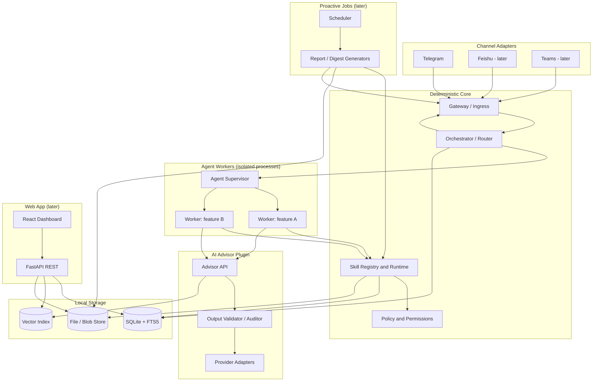
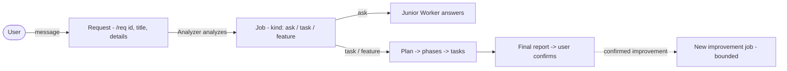
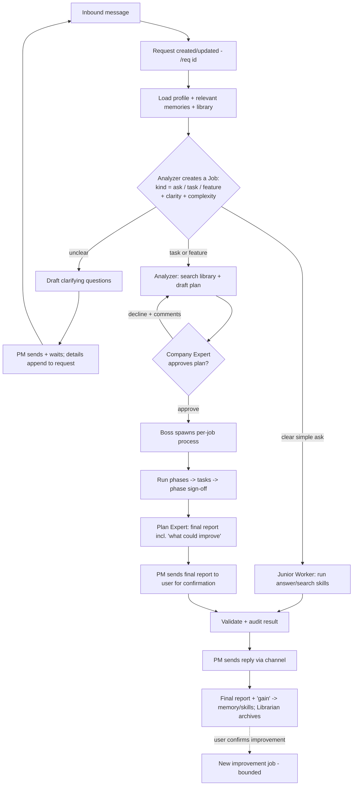
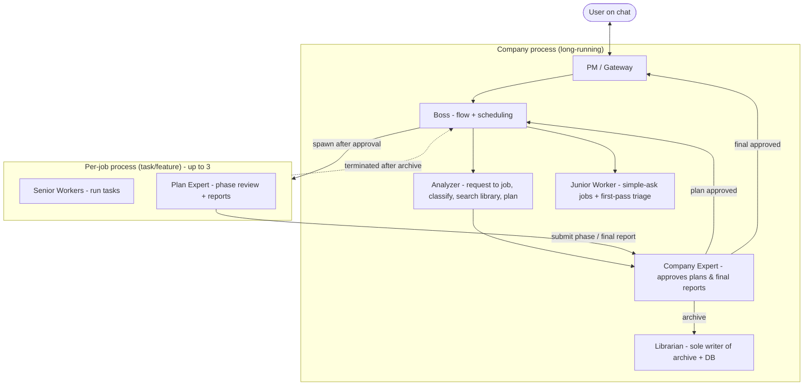
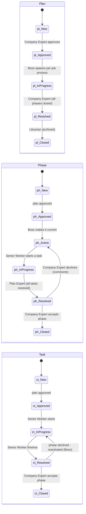
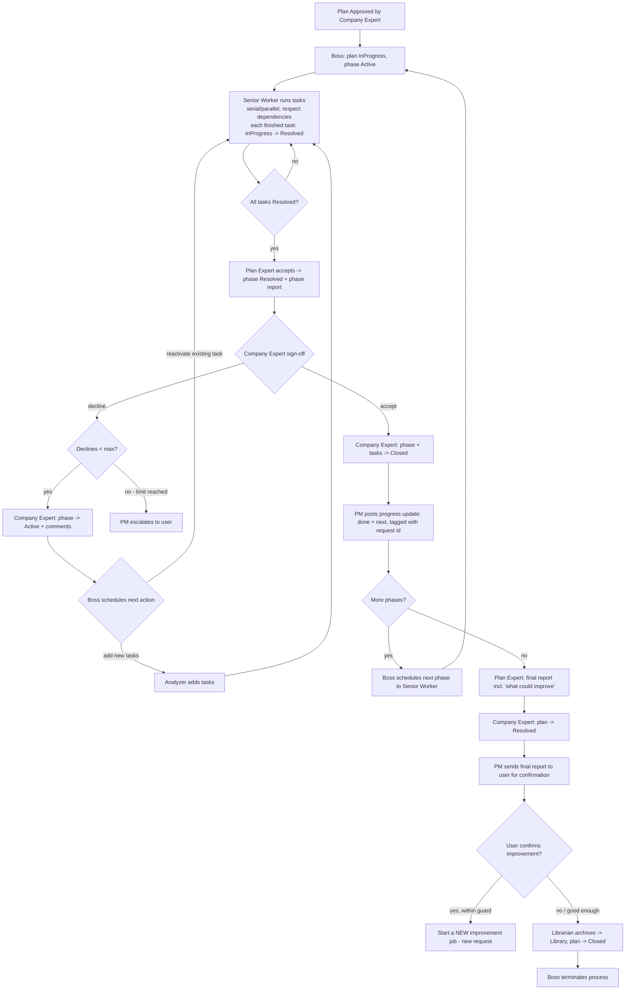
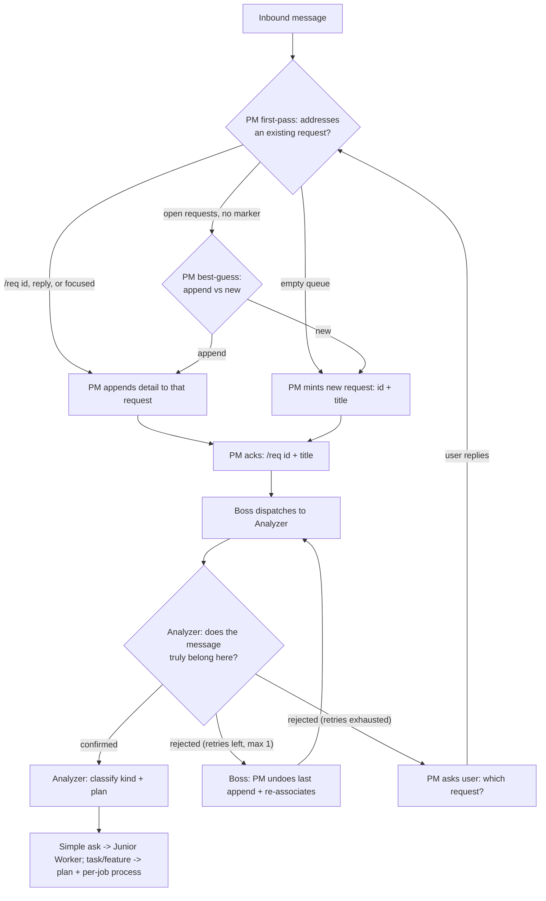
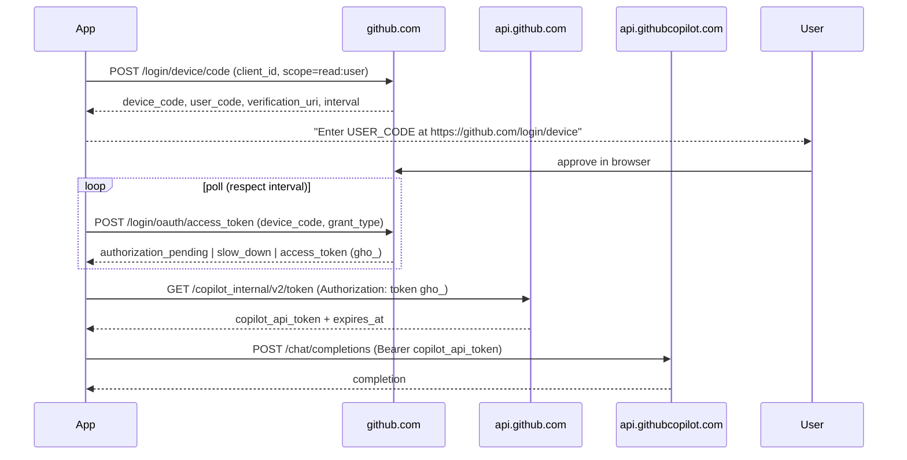
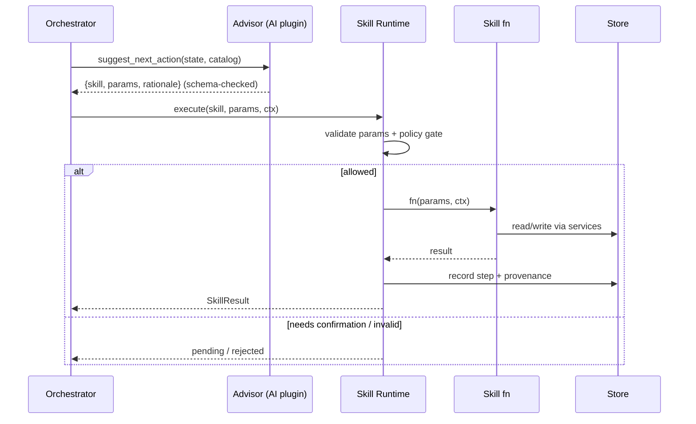

# Design Spec — Deterministic AI Assistant Platform

> **Status:** DRAFT for review
> **Owner:** @abel
> **Last updated:** 2026-06-14

A local-first assistant platform that talks to users over chat (Telegram → Feishu → Teams),
fulfills **asks** (answer questions) and **requests** (complex multi-step tasks), and records
everything — profiles, conversations, and the full *process* of each task — into a local,
searchable memory.

The defining constraint: **AI models are plugins/advisors, never the control path.**
Deterministic code decides what runs; AI only *understands* and *suggests*. Every AI output is
validated and audited before any action is taken.

---

## 1. Goals & Non-Goals

### Goals
- **Multi-channel intake.** Receive asks/requests over Telegram first; Feishu and Teams behind the same adapter interface.
- **Deterministic control.** All capabilities are code-defined **skills (APIs)**. The flow is driven by a state machine, not by the model.
- **AI as advisor/plugin.** Models do NLU, classification, extraction, drafting, and *propose* the next action; they never execute it directly.
- **Model-agnostic.** Swap models via config. No skill or control code references a fixed model.
- **Local-first memory.** SQLite + local files; hybrid keyword + semantic search over profiles, chats, and task processes.
- **Auditable.** Every AI call, validation, decision, and skill execution is recorded.

### Non-Goals (initial)
- Multi-tenant / large-scale hosting (single-user, local-first).
- Autonomous, unsupervised action on complex requests (we always confirm complex plans).
- Training/fine-tuning models (we only consume them as plugins).

---

## 2. Confirmed Decisions

| Area | Decision |
|------|----------|
| Backend language | **Python** (FastAPI) |
| Frontend | **FastAPI REST + lightweight React/TS** (Vite); built later (chat first) |
| Memory/search | **Hybrid**: SQLite **FTS5** + **in-SQLite vector (`sqlite-vec`)**; per-task **cards** (keywords + tags + short description) |
| AI providers | **Provider abstraction**; **model definitions in a folder** (`config/models/`), tokens from env. **Login via OAuth device flow** to **GitHub Copilot** (well-known client ID, **no app registration** — per OpenClaw/Hermes); **GitHub Models PAT** / OpenAI / Azure / Ollama swappable. Per-role model assignment is **auth/endpoint only — no shared skills/memory** (§7/§7.2). |
| Web/live search | **Bing Web Search API** via a deterministic `web.search` skill (GitHub Models has no native web-search tool); anti-crawl-aware |
| Secrets | **Env variables are secrets**: never written to logs, never sent to any AI model in a request, never shown to the user. Secret redaction guard before every model call/log/reply; **PII not redacted**. |
| Vocabulary | **Request** (what the user sends) → **Job** (created by the Analyzer, carries the **kind**: ask / task / feature) → **Plan** (for complex jobs). task + feature = a **complex job** (§5). |
| Orchestration | **Role-based multi-agent**: one long-running **company** process (PM, Boss, Analyzer, Junior Worker, Company Expert, Librarian as threads) + a **per-job process** (Senior Workers + Plan Expert) spawned on plan approval (§6A). |
| Planning | **Plan → phases → (recursive) tasks**; serial/parallel with dependencies; per-phase expert sign-off; **job pausable** (a `paused` flag); plans **revisable mid-flight** when the user adds info; status lifecycle (§6B). |
| Completion | On finish, the **final report (incl. “what could improve”) is sent to the user for confirmation**; a confirmed improvement starts a **new bounded job** (no forced generalize phase). |
| Concurrency | **Max 3** concurrent complex-job processes (configurable); simple asks handled in the company process. **Multiple requests multiplexed** — each has a **`/req <id>` (`YYYYMMDDHHmmSS`) + title**; user can ask progress, interrupt, pause, or abandon; PM posts **progress updates** per request (§6C). |
| AI sessions | **Senior Worker & Plan Expert keep a warm AI session/cache** (recoverable on crash); **PM, Boss, Analyzer, Junior Worker, Company Expert, Librarian are transient** — Junior Worker drops idle sessions after ~15 min (§6A). |
| Library & recovery | Finished work saved to **local folders** (in-flight under `Active/` split by kind — `Simple/`, `Tasks/`, `Features/` — then `Archive/`) + **DB & index file**; **all roles read** by keywords/tags/description; only the **Librarian** writes the archive/DB; **all state recoverable** from folders + DB (§9). |
| Memory management | **Weighted + TTL memory** with decay, **reinforcement on use _or_ read** (a memory/archived-report **read** refreshes TTL + weight and revives a cold item), consolidation/forgetting, archival; bounded total (§9.1). |
| Chat platforms | **Unified adapter**, **Telegram first**; Feishu + Teams later |
| Users | **Single user** now; multi-user later (tenancy hierarchy already built in) |
| Deployment | **Local-first**, **chat-first**; web server + proactive reports later |
| Control policy | Triage (see §6): clear simple ask → **auto** (incl. search); unclear → clarify; complex → plan + expert sign-off |

---

## 3. Design Principles

1. **AI out of the control path.** The model returns *structured proposals* (`{skill, params, rationale}`); deterministic code validates and decides whether/how to run them.
2. **Skills are APIs.** Every capability is a registered function with a name, typed parameters (JSON Schema), permissions, and a pure implementation. The AI sees the catalog and picks from it.
3. **Validate everything from the model.** All AI outputs are schema-checked (pydantic) and policy-checked. Invalid output → repair/retry or fall back to a deterministic default or a human question.
4. **Model independence.** A role→model mapping in config means tasks (triage, planning, drafting, embedding) can each use different, swappable models.
5. **Record the process, not just the result.** Each task stores its plan and every step (skill, params, result, provenance, AI calls) so it can become memory.
6. **Local & private by default.** No external calls unless a skill explicitly makes one. Secrets via env, never in the DB.
7. **Codify what generalizes.** If an AI call's input→output mapping is stable enough to fix/generalize, implement it as a **skill** (deterministic code) and stop calling the model for it. AI is reserved for genuinely open-ended understanding; recurring AI patterns get *promoted* to skills over time — shrinking reliance on unreliable output.
8. **Isolate agents per feature.** Each complex feature/ask runs in its own scoped worker process (tenant → workspace → feature → agent) so parallel work can't interfere. Because model calls are stateless, session/cache state lives in the deterministic worker, not the model.

---

## 4. High-Level Architecture



### Components
- **Channel Adapters** — normalize inbound platform messages into a canonical `InboundMessage`; send replies via a canonical `OutboundMessage`. Handle webhooks/long-poll, attachments, identity.
- **Gateway / Ingress** — authenticate/identify user, resolve cross-channel identity, load/create session, enqueue work.
- **Orchestrator / Router (control path)** — routes each task to the right agent worker by `(tenant, workspace, feature)`; owns the deterministic state machine contract: triage → clarify/plan/execute → validate → reply → record.
- **Agent Supervisor & Workers** — a pool of **isolated child processes**, one per running feature, that hold the warm session/cache and run the per-task state machine. See §6A.
- **Skill Registry & Runtime** — registered skills with JSON-Schema params; validates params, enforces permissions, executes, captures result + provenance.
- **AI Advisor (plugin)** — model-agnostic interface for triage/extraction/planning/drafting/embedding; wraps provider adapters; all outputs pass the validator/auditor.
- **Memory & Storage** — SQLite (relational) + FTS5 (keyword) + vector index (semantic) + local blob store; weighted/decaying memory; repositories per entity.
- **Web App (later)** — FastAPI REST API + React dashboard to browse/search data, review task processes, approve/reject pending plans, manage profiles/models/skills. Chat is the first interface; the web app is added once core flows work.
- **Proactive Jobs (later)** — a scheduler that runs skill-based generators (e.g., a daily report on the user's interests), stores the result as an artifact, and delivers it over chat now (or the web server later). Same deterministic runtime + AI advisor + validation as everything else.

---

## 5. Vocabulary — Request, Job & Kind

Three nouns, in order of creation:

1. **Request** — *what the user sends to the PM.* The durable, user-facing envelope: a `/req` id (§6C), a title, the original message, and any **details appended later** (when the PM asks for more info, the answers attach to the same request). The user tracks everything through the request.
2. **Job** — *what the Analyzer creates from a request.* The internal **unit of work**, carrying the **kind** (ask / task / feature) and a working folder. The originating request is **linked** to the job; later request details flow into it. (Default **one job per request**; the request is the conversation, the job is the work.)
3. **Plan** — *what a complex job needs.* For a **task** or **feature** job, the Analyzer builds a **plan → phases → (recursive) tasks** (§6B). A **simple ask** job needs no plan.



### Job kinds

| Kind | Definition | Plan? | Where it runs | Folder |
|------|-----------|-------|---------------|--------|
| **Ask** | Only needs search + answer. *E.g. "What's the weather this weekend?"* | No | **Company process** — assigned to the **Junior Worker** | shared `Active/Simple/` |
| **Task** | A **complex** job that does **not** require new code to repeat, though it may still **produce reusable functions/skills** and **save user characters**. *E.g. "Compare these three vendors and recommend one."* | Yes | **Per-job process** | own folder in `Active/Tasks/` |
| **Feature** | Needs **new code / a new skill** so the capability can be **repeated** later. *E.g. "Send me a daily report on my interests."* | Yes | **Per-job process** | own folder in `Active/Features/` |

- **Task + Feature = a "complex job."** Both get a **plan**, a dedicated **process**, an `Active/Tasks/` or `Active/Features/` folder (by kind), expert **sign-off**, and a **final report**.
- **A feature job produces reusable code/skills as part of its plan** (its deliverable); a task job may produce helpers opportunistically. There is **no forced "generalize" phase** — broader improvements are handled by the **final-report → improvement-job loop** (§6B).
- **Asks** are the fast path: no plan, no separate process, answered (with validated sources) by the Junior Worker and logged under `Active/Simple/`.
- **Every** job — ask, task, feature — ends with a **final report + experience ("gain")**: the report is **sent to the user for confirmation** and then distilled into memory/skills and archived (§9.2). The gain's *improve* notes can spawn a **new improvement job** if the user confirms (§6B).

### Classification labels
When the Analyzer turns a request into a job it assigns: `kind ∈ {ask, task, feature}`, `clarity ∈ {clear, unclear}`, `complexity ∈ {simple, complex}`, each with a confidence score + rationale. The **Junior Worker** does a cheap **first-pass** triage on intake (is this a simple ask I can just answer?); the **Analyzer** makes the **authoritative** classification and (for complex jobs) searches the library and builds the plan (§6A).

---

## 6. Control Flow (overview)

Deterministic code is the **only** thing that executes skills; AI advises at marked points. This section is the bird's-eye flow; **§6A** details the roles/processes and **§6B** the plan/phase/task lifecycle.



### Triage policy (encodes your rule)
- **Clear + simple ask** → execute directly, validate, answer (no approval).
- **Unclear (any kind)** → AI drafts clarifying questions, PM sends them, wait, the user's answers **append to the request**, re-analyze.
- **Task / feature (complex)** → Analyzer drafts a plan mapped to known skills, **Company Expert signs off** before any execution; phases are re-reviewed as they complete (§6B).

### Step execution loop (within a task)
1. Build step context (profile + retrieved memories + prior step results).
2. Advisor proposes next action `{skill, params, rationale}` **or** plan is followed step-by-step.
3. **Validate** params against the skill's JSON Schema; **policy check** permissions/side-effects.
4. If allowed → execute skill → capture `result + provenance`; else → escalate (confirm/clarify).
5. Record `step` row + any `ai_calls`; optionally advisor summarizes/validates the result.
6. Loop until plan complete or a terminal condition; then draft + validate + send final reply.

> The advisor can *suggest* finishing, retrying, or branching, but the orchestrator's rules and the validated skill catalog decide what actually happens.

---

## 6A. Roles, Processes & Multi-Agent Orchestration

The system is organized like a small **company of role-players**. Each role is an **AI-advised but code-controlled** agent. Roles run as **threads inside a process**; requests that need real work get **their own process** so they run in parallel without interfering. Because AI calls are **stateless**, all session/cache/working state lives in **deterministic code + per-request folders + SQLite** — never in the model — so everything is recoverable.

### Two kinds of process

1. **Company process (one, long-running).** Always up. Hosts the standing roles as threads and handles all **simple-ask jobs** directly. Owns intake, analysis (request → job), planning, sign-off, and archival.
2. **Per-job process (one per active complex job).** Spawned by the **Boss** *after a plan is approved*, for a **task** or **feature** job. Hosts the execution roles as threads, does the actual phase/task work, then is **terminated** once the result is archived. **Max 3 run concurrently** (configurable); extras queue.

> Roles are **threads** (work here is I/O-bound: model calls, network, DB). True CPU parallelism *between* jobs comes from the separate **processes**, capped at 3.



### Roles ("employees")

**Company process (standing roles):**

| Role | Responsibility |
|------|----------------|
| **PM / Gateway** | The only role that chats with the user. Receives **requests**, asks clarifying questions, **appends details to the request**, relays info produced by other roles, and delivers the final result. |
| **Boss** | Manages flow and **scheduling**; drives statuses; **spawns the per-job process** once a plan is approved and **terminates** it after archival; enforces the concurrency cap (3). |
| **Analyzer** | First decides whether an **unaddressed message** starts a **new request** or **appends to an open one** (§6C); then turns a **request into a job**: assigns the **kind** (ask/task/feature), **searches the library** (DB + folders) for reusable memory/skills/prior work, and — for complex jobs — **creates the plan** (phases → tasks). |
| **Junior Worker** | Cheap, fast **first-pass triage** on intake (is this a simple ask?) and **handles simple-ask jobs** end-to-end (search + validated answer). **Separate from the Analyzer:** it hands anything non-trivial to the Analyzer for authoritative classification + planning. |
| **Company Expert** | **Approves/declines plans**; reviews phase submissions and the **final report**; reviews Junior Worker output; generates the **archive report incl. user character** (habits, likings, location, …) when warranted. **Separate from the Plan Expert:** it lives in the **company process** and may use a **different (stronger) model** for sign-off than the per-job Plan Expert. |
| **Librarian** | **Sole writer** of the archived **Library** folders and DB tables; indexes keywords/tags/descriptions; performs archival and retrieval bookkeeping. |

**Per-job process (execution roles, spawned on approval):**

| Role | Responsibility |
|------|----------------|
| **Senior Worker(s)** | Execute **tasks** (`Approved → InProgress → Resolved`); move the owning phase `Active → InProgress`. Multiple may run in parallel for independent tasks. |
| **Plan Expert** | Reviews task results; when **all** tasks of a phase are done, marks the phase **Resolved**, writes the **phase report**, and **submits it to the Company Expert** for sign-off; assembles the **plan's final report**. Runs **inside the per-job process** and may use a **different model** from the Company Expert. |

> **Role separations (decided).** **PM (first-pass request-routing: auto-assign id, best-guess append-vs-new)** and **Analyzer (authoritative routing validation: confirm or reject the append)** are **separate** — the same first-pass-vs-authoritative split as Junior Worker (fast first-pass triage) vs Analyzer (confirm kind + library search + planning). Plan Expert (per-request, in-process review) and Company Expert (company-process sign-off) are **separate** — they run in different processes and can use different model-roles, giving an independent second review.

### Role duties at a glance

A one-line duty roster consolidating the roles above with the status-setters of §6B. **All roles read** the Library; **only the Librarian writes** the archive/DB (everyone else proposes — § Library access & authority). "Sets" = the statuses/flags this role drives.

| Role | Process | Primary duties | Sets / signs off |
|------|---------|----------------|------------------|
| **PM / Gateway** | Company | The **only** role that talks to the user. **Auto-assigns a `/req <id>` to every inbound message (first-pass routing: mint-new on an empty queue, else best-guess append-vs-new — §6C)**; receives requests, asks clarifications, appends details, posts progress updates, delivers and confirms the final report, runs `/req` commands, surfaces the device-flow login code, and escalates when the Boss/Expert ask. On an Analyzer reject, **undoes the last append and re-associates** it (≤1). | mints `requests` (id+title) + appends `request_details`; on reject undoes/re-associates |
| **Boss** | Company | **Flow + scheduling**: dispatch each request to the Analyzer and, on an **append reject**, ask the PM to **undo + re-associate** (bounded by `max_append_reroutes`, default 1; then PM clarifies — §6C); spawn the per-job process on approval, schedule the next action after each decision/user action, set & clear the job's `paused` flag, enforce the **max-3** concurrency cap, terminate the process after archive. | plan `→ InProgress` (spawn); phase `→ Active`; job `paused` on/off; drives append undo/re-route |
| **Analyzer** | Company | **Validate the PM's append/new association** for a dispatched request — **reject a wrong append** (→ Boss undo/re-route — §6C); classify **kind / clarity / complexity**; search the Library for reuse; draft and revise the **plan → phases → tasks**. | rejects wrong appends; drafts plan/phases/tasks as `New` |
| **Junior Worker** | Company | Cheap **first-pass triage** on intake; handle **simple asks** end-to-end (search + validated answer); assemble the ask's final report. | — (ask path; no plan) |
| **Company Expert** | Company | **Approve/decline plans**; sign off completed **phases** and the **final report**; review Junior Worker output; extract user characters for archival. | plan `Approved` / `Resolved`; phase `Closed` or `→ Active` (decline); task `Closed` |
| **Librarian** | Company | **Sole writer** of the archive + DB: commit `final_reports`, `library_index`, `memory*`, move folders to `Archive/`, keep `index.json` in sync. | plan `Closed` (after archive) |
| **Senior Worker(s)** | Per-job | Execute **tasks** (respect dependencies; serial/parallel); keep a recoverable warm session. | task `InProgress` / `Resolved`; phase `Active → InProgress` |
| **Plan Expert** | Per-job | Review task results; when all of a phase's tasks are done write the **phase report**; assemble the plan's **final report**; keep a recoverable warm session. | phase `Resolved` |

> **Single-writer rule.** Only the **Librarian** commits archive folders and library/memory DB tables; every other role's "writes" are **proposals** the Librarian applies, keeping archival deterministic and race-free. Warm sessions are held **only** by Senior Worker & Plan Expert (§ AI session & cache lifecycle).

### Library access & authority
- **All roles can read** the Library (folders + DB) to **find existing / finished answers by keywords, tags, or brief description** before doing new work — so a repeat or similar request reuses prior results instead of redoing them.
- **Only the Librarian can write** (Add/Create/Write/Delete) archived folders and DB tables. Every other role proposes changes; the Librarian commits them. This keeps archival deterministic and single-writer (no races).

### AI session & cache lifecycle per role
The model API itself is **stateless** (every call re-sends its context). On top of that, a role may keep a **warm in-process "AI session"** — its accumulated working context / prompt cache — to avoid re-sending and re-deriving the same material. Whether a role keeps that warm session depends on how long-lived and topic-stable its work is:

| Role(s) | Warm AI session? | Rationale |
|---------|------------------|-----------|
| **Senior Worker, Plan Expert** | **Yes — maintained by the role.** Keep the full cached memory/context for the job and reuse it across steps/phases; **persist enough to recover** the session after a restart/crash (rebuilt from the job's `Active/<kind>/<id>/` folder + DB). | They work a single complex job over many steps where context compounds — caching pays off and continuity matters. |
| **Junior Worker** | **No long session.** May hold a short session, but it is **dropped after a configurable idle period (default 15 min)** with no user ask. | Successive asks are usually **different topics**, so a stale session adds little and wastes memory. |
| **PM, Company Expert, Librarian** | **No long session.** Invoked transiently; rebuild the little context they need per invocation. | Their work is short, bursty, and not context-compounding; no need to hold a cache. |
| **Boss, Analyzer** | **No session.** Boss is mostly deterministic control. The **Analyzer caches nothing** — everything it needs for a job is in the job's folder + the library, fetched on demand. | One-shot per decision; fully recoverable from folders/DB. |

- **Recovery (Senior Worker / Plan Expert).** Because these are the only roles holding meaningful warm state, they checkpoint enough (current step, retrieved-context refs, partial results) into the job folder + DB that a restarted per-job process **rehydrates** the session and resumes. The warm cache is an optimization; the **durable truth is still folders + DB**.
- **Idle reaping.** A background timer drops idle Junior-Worker sessions (default 15 min, `policies.yaml: junior_session_idle_minutes`) and may shrink other transient caches to bound memory.

### State, isolation & recovery
- **Per-job working folder.** Each complex job gets a folder under `Active/Tasks/<request-id>/` or `Active/Features/<request-id>/` (grouped by kind; named by the linked request's id, the user-facing handle) holding its plan, phase/task artifacts, process log, and draft reports. Simple-ask jobs share `Active/Simple/`.
- **Durable truth = folders + DB.** SQLite holds structured state (requests, jobs, plans, phases, tasks, statuses, memory, index); folders hold artifacts and reports. **All state is recoverable** from folders + DB — a crashed/terminated process is rebuilt from them.
- **Isolation.** Per-job processes share nothing in memory; they coordinate with the company process over IPC (a task/result queue) and through the DB. A crash in one job can't affect others.
- **Warm vs durable.** Only **Senior Worker** and **Plan Expert** keep a warm AI session/cache (recoverable as above); all other roles are transient. Either way, **no cache is ever the source of truth** — it is always reconstructable from folders/DB.

---

## 6B. Plan → Phase → Task Lifecycle & Status Model

For a **task** or **feature** job, the Analyzer produces a **plan**:

- A **plan** has ordered **phases**.
- A **phase** has multiple **tasks**; a task may itself have **child tasks** (recursive).
- Tasks run **serial or parallel**. A task with **dependencies waits** until *all* its dependents are `Resolved`.
- A **phase** is `Resolved` only after **all** its tasks are `Resolved` **and** the Plan Expert accepts.
- **Plans are revisable mid-flight.** When the user provides new info (via `/req <id>`), the Analyzer may **add or update phases and their tasks** on the *same* job (one job per request). To apply changes cheaply, the **job can be paused** (see *Pause / resume* below) so in-flight work stops without losing state while the plan is updated.
- When a phase is `Resolved`, it is **submitted to the Company Expert** (company process) to **review and sign off**. The Expert writes a **phase report** and **accepts** or **declines** it.
  - **Declined →** the Company Expert moves the phase **`Resolved → Active`** and attaches **comments** indicating either **reactivate an existing task** or **ask the Analyzer to add new tasks**. The **Boss** then **schedules the next action** (below). A phase may be declined at most **`max_phase_declines` times (default 3, configurable)**; beyond that the **PM escalates to the user** to decide (accept as-is, change scope, or abandon).
  - **Accepted →** the Company Expert moves the phase **and its tasks** `Resolved → Closed`, and the next phase begins.
- After the **final** phase is `Closed`, the **Plan Expert** assembles the **final report**; the **Company Expert** moves the **plan** `→ Resolved`; the **PM delivers the final report to the user for confirmation** (the report includes *what could be improved* — see *Final report & improvement loop*); the **Librarian** archives all artifacts and then moves the **plan** `Resolved → Closed`; the **Boss** terminates the per-job process.

### Pause / resume
**Pause is a job-level flag, not a status.** The **job** carries a boolean **`paused`** (with `paused_at`); setting it suspends the whole job — its plan, phases, and tasks — while every entity **keeps its current status**, so resuming always knows the last state. No plan/phase/task executes while `paused` is true.
- **Pause (`paused = true`, Boss — on plan update or user action).** The Boss stops scheduling and the per-job process makes no model calls; in-flight work is **checkpointed** (warm session + partial results → job folder + DB). Statuses are left untouched — a running task stays `InProgress`.
- **Resume (`paused = false`, Boss).** The Boss re-evaluates the (possibly updated) plan and schedules the next actionable work. If the plan changed while paused, the Senior Worker may **start a new task** rather than continue the interrupted one — a superseded in-flight task is abandoned/re-derived by the Analyzer, not blindly resumed.
- A paused job **holds its concurrency slot** so it can resume immediately once the user provides more details or confirms. Pausing is **non-destructive**; the durable truth is still folders + DB.

### Boss scheduling
The **Boss** decides what runs next based on each Company-Expert decision and any user action:
- **Phase accepted (`Closed`) and more phases remain →** schedule the **next phase** to the **Senior Worker** who owns the plan.
- **Phase declined (`→ Active`), reactivate existing task →** schedule the **declined phase's task(s)** back to the **Senior Worker** (with the Expert's comments).
- **Phase declined (`→ Active`), needs new work →** schedule the **Analyzer** to **add new tasks** to the phase; once added, their `Senior Worker` runs them.
- **New user info →** set the job's **`paused`** flag, have the **Analyzer** add/update phases & tasks, then **clear `paused`** to resume.
- **User action (interrupt / pause / abandon) →** set the job's **`paused`** flag, or **abandon** the work (plan/phases/tasks → `Abandoned`) (§6C).
- **Decline limit reached (`max_phase_declines`, default 3) →** stop the loop and have the **PM escalate to the user**.

### Status lifecycle
The state set is **New, Approved, Active, InProgress, Resolved, Closed**, plus **Abandoned** (cancelled/declined-for-good) reachable from any active state, and applies to the **plan, phase, and task**. **A job has no status of its own:** a complex job maps **1:1 to its plan**, so the **plan's** status *is* the job's lifecycle; an **ask** job has no plan — it is a one-shot answered immediately, its state carried by the request + final report. **Pause is not a status** — it is a boolean **`paused` flag on the job** that suspends all its plan/phase/tasks while each keeps its current state (see *Pause / resume*), so resuming always knows the last state. Not every entity uses every state: **Approved** is the plan-approval gate (plan/phase/task), and **Active** marks the *current* phase (phases only). The key idea: a worker/expert marks work **Resolved**; the **Company Expert** signs off to **Closed** (accept) or sends a phase **back to `Active`** (decline with comments); the **Librarian** does the final plan `Closed` after archiving.

| Entity | Transitions (who) |
|--------|-------------------|
| **Task** | `New` (drafted with the plan) → `Approved` (plan approved) → `InProgress` (Senior Worker starts) → `Resolved` (Senior Worker **finishes the task**) → `Closed` (Company Expert, when it **accepts the owning phase**). On phase decline, a reactivated task goes `Resolved → InProgress` again (Boss schedules it). Blocked tasks wait on dependencies. |
| **Phase** | `New` (drafted with the plan) → `Approved` (plan approved) → `Active` (Boss makes it the current phase) → `InProgress` (Senior Worker starts a task) → `Resolved` (**Plan Expert**, when all tasks `Resolved` **and** Plan Expert accepts) → **`Closed`** (**Company Expert** accepts) **or** **`→ Active`** (**Company Expert** declines, with comments; up to `max_phase_declines`). |
| **Plan** | `New` (Analyzer drafts) → `Approved` (Company Expert approves the plan) → `InProgress` (Boss spawns the per-job process) → `Resolved` (**Company Expert**, after **all phases `Closed`**) → `Closed` (**Librarian**, after **all artifacts archived**). The Analyzer may **add/update phases** while active. *Because job ↔ plan is 1:1, this row is also the job's lifecycle.* |
| **Any** | → `Abandoned` (user cancels or Company Expert declines permanently), reachable from any active state. **Pause** is not a status: the job's `paused` flag suspends all its plan/phase/tasks while they keep their current state. |

> **Who sets `Resolved` vs `Closed`:** Senior Worker → task `Resolved`; Plan Expert → phase `Resolved`; **Company Expert → accept: task & phase `Closed`; decline: phase `→ Active` + comments; plan `Resolved` (all phases closed)**; **Librarian → plan `Closed` (archived)**. The **Boss** schedules the next action — and sets/clears the job's **`paused`** flag — after each decision or user action.



> Not shown: every active state can also move to **Abandoned** (user cancels or the Company Expert declines for good). The **job** has no sub-machine of its own — it is 1:1 with its **Plan** above. **Pause** is also omitted because it is a job-level **`paused`** flag, not a status — it suspends execution while each entity keeps its current state.



### Final report & improvement loop
There is **no automatic generalize phase**. Instead, when a job's plan is `Resolved`, the **Plan Expert's final report** is **sent to the user for confirmation** (PM). The report's **gain** section names **what could be improved in the system** (refactors, reusable skills to extract, follow-ups — §9.2).

- **User confirms an improvement →** a **new job** (a fresh request, linked to the original via `improves_request_id`) is started to do it. Improvement work is therefore *explicit and opt-in*, never a forced tail on every job.
- **User declines / says "good enough" →** the job closes as-is.
- **Endless-improvement guard.** Improvement chains are bounded: each confirmation step lets the user **stop**, and `policies.yaml` caps an auto-suggested chain (`max_improvement_iterations`, default 2) so the system never loops on "improve the improvement" without the user. The user can stop at any point if an improvement isn't paying off.

> **Generated code still gated.** When a **feature** job (or an improvement job) produces reusable code/skills as part of its normal plan, the existing rule applies: **proposed → reviewed (Plan Expert) → user-confirmed (`confirm_generated_code: true` by default) → activated** under `backend/app/skills/generated/<job>/`; inert until confirmed. This is no longer tied to a special "last phase."

### Progress updates
The **PM posts a progress update to the user after every phase sign-off** and on major status changes (plan approved, started, declined-with-rework, escalated, completed). Each update is **tagged with the request id + title** (§6C) so it's clear which request it refers to when several are running. Cadence is configurable in `policies.yaml` (`progress_updates: phase | status | off`; default `phase`).

---

## 6C. Concurrent Requests — multiplexing, ids & titles

The user can **send a new request while others are still running**. The PM multiplexes several conversations at once, so requests must be individually addressable.

### Request identity
- On intake, every request gets a **timestamp id** (`code` = **`YYYYMMDDHHmmSS`**, e.g. `20260614153000`) addressed as **`/req 20260614153000`** **and a title** (AI-drafted from the first message, **user-editable**).
- The `/req <id>` + title appear in **every PM message about that request** (acknowledgement, clarifications, progress updates, final delivery) and are searchable in the library.
- A request is **linked to its job** (§5); details the user adds later **append to the request** and flow into that job. Simple-ask requests also get an id but are usually answered immediately (no progress stream).

### Routing inbound messages (PM first-pass → Analyzer validation)
**Every inbound message is attached to a request immediately, then re-checked before planning** — a cheap **PM first-pass** assignment on intake, validated by an **authoritative Analyzer** check after the Boss dispatches it. (Same two-tier idea as Junior-Worker triage vs. Analyzer classification — §6A.)

**Stage 1 — PM first-pass (on intake, fast).** The PM gives **every** message a home so nothing is left unaddressed, and **auto-assigns a `/req <id>`**:
1. **Explicit address (deterministic).** Starts with **`/req <id> …`**, or is a reply/thread to a prior PM message about a request → **append** to that request; no AI.
2. **Focused request (deterministic).** If the user ran **`/req <id>`** to focus it (or the last exchange was about it) with no new-request markers → continue that request.
3. **Empty queue (deterministic).** **No open requests** → the message can only be new → PM **mints a new request** (new `/req <id>` + title).
4. **Open requests, no explicit address → PM best-guess.** The PM compares the message against open/recent requests (semantic similarity + recency + any request **awaiting the user's answer**) and **either appends** it to the best match **or mints a new request**, recording the chosen target + candidate + confidence on the append. The PM **doesn't block** — the guess is provisional and validated in Stage 2. (A **pending clarifying question** strongly biases toward **append** to the asking request.)

The PM acknowledges with the resolved **`/req <id>` + title** so the user can correct a mis-route at once.

**Stage 2 — Analyzer validation (after Boss dispatch, authoritative).** The Boss dispatches the request to the **Analyzer**, which **re-checks whether the appended message truly belongs** before any planning:
- **Confirmed →** proceed: classify **kind / clarity / complexity**, search the Library, and (for complex jobs) draft/update the plan.
- **Rejected (wrong association) →** the Analyzer **rejects the append**; the **Boss asks the PM to undo the last append** (detach it) and **re-associate** the message with the correct target (an existing request or a new one). The re-routed message is dispatched again for validation. **Bounded retry: `max_append_reroutes` (default 1).**
- **Still wrong after the retry (or no confident target) →** the **PM asks the user to clarify** ("is this part of `/req <id>` «*title*» or a new request?"); the user's answer is authoritative.

This keeps AI out of the control path: the PM's first-pass and the Analyzer's validation only **advise** the new-vs-append label; **deterministic code** applies the confident cases, bounds the retry, and **defers to the user** when both passes disagree or stay unsure.

#### Undo & reject tracking — no new `requests` column (decision)
**We do *not* add a property to `requests` to track the reject.** What gets rejected/undone is the **append**, which is a `request_details` row — so its lifecycle is tracked **there**, and the reject is an **event** in `audit_log`:
- **Wrong append** → set the offending `request_details.state = rejected` (or `reassigned`) and write a fresh `active` detail under the correct request — that *is* “undo last append + re-associate”.
- **Wrongly-minted new request** (PM guessed *new*, Analyzer says *append*) → drop it via the **existing** `requests.state = dropped`; still no new column.
- **Audit** → one `audit_log` row per reject (`actor = analyzer`, `action = reject_append`, `target = detail/request`), so the trail survives without mutable flags on `requests`.
- **Retry bound (max 1)** → routing-control state owned by the Boss for the in-flight handshake; persisted as `request_details.reroute_count` only so a mid-reroute restart is recoverable.

### Delivering details to the right request
- New details for a running complex job are queued to **that job's process** (its `Active/<kind>/<request-id>/` folder + inbox); the Boss **pauses the job** (`paused`), has the **Analyzer** add/update phases & tasks, then **resumes** — under the normal plan/sign-off rules (no mid-flight corruption).
- Up to **3 complex jobs run concurrently** (§6A); extras queue with status shown to the user.

### User actions on a running job
The user can act on any job at any time via the PM:
- **Ask progress** — the PM reports the job's status: phases **done**, current phase, and **what's next** (the PM also pushes this automatically as each phase is signed off).
- **Interrupt / correct** — send new details to **fix something in the request**; the Boss pauses, the Analyzer updates the plan, then resumes.
- **Pause / resume** — temporarily stop work to save cost/time.
- **Abandon** — cancel the job (its plan/phases/tasks → `Abandoned`; an ask, having no plan, is simply dropped).

### User-facing commands (PM)
- **`/req`** — list active/queued requests with `id`, title, kind, status, current phase.
- **`/req <id>`** — focus that request and show its **progress** (done / current / next).
- **`/req <id> <message>`** — append new details/instructions (may pause → update plan → resume).
- **`/req <id> pause`** / **`/req <id> resume`** — pause or resume the job.
- **`/req <id> rename <title>`** — set a friendlier title.
- **`/req <id> cancel`** — abandon the request/job (→ `Abandoned`).



> Concurrency is bounded and deterministic: ids/titles are assigned by code, routing decisions are validated, and each job's state lives in its own `Active/<kind>/<request-id>/` folder + DB rows — so parallel jobs never share working state, and the user can always tell them apart.

---

## 7. AI Advisor & Provider Abstraction (the "plugin")

A thin, model-agnostic layer. **Model definitions live in a folder** (`config/models/`), one file per model, each naming its provider kind, model id, and the **env var** holding its API token. A separate binding maps **model-roles** (and, optionally, **agent roles**) to those definitions, so each kind of work can use a different swappable model.

> **Terminology:** "model-role" (triage/planner/drafter/embedder) is a **config knob for model selection** — distinct from the **agent roles** (PM, Boss, Analyzer, …) in §6A. An agent role *uses* one or more model-roles when it calls the advisor.

```python
# Provider transport — the only thing that knows about a specific backend.
class AIProvider(Protocol):
    def complete(self, req: CompletionRequest) -> CompletionResponse: ...
    def embed(self, req: EmbedRequest) -> EmbedResponse: ...

# Concrete adapters (selected by config, never referenced by skills/core):
#   GitHubCopilotProvider(model)            # device-flow token (§7.2)
#   GitHubModelsProvider(model, api_key_env, org_env)
#   OpenAICompatibleProvider(base_url, model, api_key_env)
#   OllamaProvider(base_url, model)

# Advisor — schema-constrained helper tasks. Every method returns validated data.
class Advisor:
    def triage(self, msg: InboundMessage, ctx: Context) -> Triage: ...
    def make_plan(self, job: Job, ctx: Context) -> Plan: ...
    def suggest_next_action(self, state: TaskState) -> ProposedAction: ...   # {skill, params, rationale}
    def draft_clarification(self, job: Job, ctx: Context) -> list[str]: ...
    def draft_reply(self, ctx: Context) -> str: ...
    def summarize(self, text: str) -> str: ...
    def extract_traits(self, msgs: list[Message]) -> list[Trait]: ...
    def embed(self, texts: list[str]) -> list[Vector]: ...
```

**Validation/audit wrapper.** Every advisor call:
1. Renders a prompt from a versioned template.
2. Calls the provider for the configured **role** (model-role, or per-agent-role override — §7.0).
3. Parses output into a pydantic schema (structured/JSON mode); on failure → bounded repair/retry → fallback (deterministic default or human question).
4. Writes an `ai_calls` audit row (role, model id, prompt/response refs, tokens, latency, validation status) — **never the API token** (§12).

### 7.0 Model definitions folder & per-role assignment

**Folder of model definitions.** Each file under `config/models/` defines one model:
```
config/
  models/
    copilot-fast.yaml      # kind: github_copilot, model: gpt-4o-mini
    copilot-quality.yaml   # kind: github_copilot, model: gpt-4o
    copilot-embed.yaml     # kind: github_copilot, model: text-embedding-3-small
    openai-quality.yaml    # kind: openai_compatible, model: gpt-4o, api_key_env: OPENAI_API_KEY
  model-bindings.yaml      # roles -> model file; optional per-agent-role overrides
```
A model file:
```yaml
# config/models/openai-quality.yaml
name: openai-quality
kind: openai_compatible          # github_copilot | github_models | openai_compatible | ollama
model: gpt-4o
base_url: https://api.openai.com/v1
api_key_env: OPENAI_API_KEY      # the TOKEN lives in .env, never inline (see §12)
```

**API tokens come only from env.** A model file references an **env var name** (`api_key_env`), never the token itself. All such env vars are secrets and are **never logged, never sent to any AI model in a request, and never shown to the user** (§12).

**Per-role assignment is auth/endpoint only (no shared skills or memory).** A binding can assign a model to a **model-role** and may **override per agent role** (e.g. give the Company Expert a stronger model than the Plan Expert, §6A):
```yaml
# config/model-bindings.yaml
roles:                 # model-roles -> model definition
  triage:    copilot-fast
  planner:   copilot-quality
  drafter:   copilot-quality
  extractor: copilot-fast
  embedder:  copilot-embed
agent_roles:           # OPTIONAL per-agent-role override (auth/model only)
  company_expert: openai-quality
  plan_expert:    copilot-quality
```
Assigning a model to a role binds **only** that role's **credentials + endpoint + model**. It does **not** share that role's **skills, memory, AI session, or context** with any other role — even two roles on the same model are fully isolated (§6A). The model is a pluggable credential, not a channel between roles.

**Config example** — *default models use **GitHub Copilot** via device-flow login (Route A, §7.2); swap any file to GitHub Models PAT / OpenAI / Azure / Ollama with no code changes:*
```yaml
# config/models/copilot-quality.yaml
name: copilot-quality
kind: github_copilot               # OpenAI-compatible; device-flow login + token exchange
model: gpt-4o
# (no api_key_env: the token comes from the device-flow cache, §7.2)

# --- Alternatives (drop in a different file, or edit one — no code change) ---
# GitHub Models REST (PAT):   kind: github_models, model: openai/gpt-4o,
#                             api_key_env: GITHUB_MODELS_TOKEN, org_env: GITHUB_ORG
# BYOK OpenAI:                kind: openai_compatible, model: gpt-4o,
#                             base_url: https://api.openai.com/v1, api_key_env: OPENAI_API_KEY
# Local (later):             kind: ollama, model: llama3.1:8b, base_url: http://localhost:11434
```
Swapping a model = editing a file in `config/models/` (or repointing a role in `model-bindings.yaml`). No code changes.

**GitHub provider specifics.** Both GitHub routes are **OpenAI-compatible**; the provider kind handles auth + headers:
- **Route A — `github_copilot` (default).** Endpoint `https://api.githubcopilot.com/chat/completions`. Auth via **device-flow login** (§7.2): a raw `gho_` token is exchanged for a short-lived Copilot API token used as `Authorization: Bearer …`, with Copilot headers (`Editor-Version`, `Copilot-Integration-Id`, …). Requires a **Copilot-entitled** GitHub account. No app registration.
- **Route B — `github_models` (alternative).** Endpoint `https://models.github.ai/inference` (or `…/orgs/{org}/inference` when `GITHUB_ORG` is set). Auth via a **fine-grained PAT with `models: read`** (`GITHUB_MODELS_TOKEN`); headers `Accept: application/vnd.github+json` + `X-GitHub-Api-Version` added automatically. Model IDs `{publisher}/{model}`; catalog at `https://models.github.ai/catalog/models`. Enterprise owner must enable GitHub Models; free tier is rate-limited (~10–20 req/min) — opt into paid/BYOK for sustained use.

See **§7.2** for the device-flow login and the components that implement it.

### 7.1 Web search & live information

Answering some asks needs fresh, external information. Since the default provider (GitHub Models) has **no native web-search tool**, live retrieval is a **deterministic skill** backed by the **Bing Web Search API**:

1. **`web.search` (primary).** Calls the **Bing Web Search API**, which returns ranked results + titles + snippets (and we can `web.fetch` + extract a specific URL when deeper text is needed). Using an official search API — not broad page scraping — is the main defense against **anti-crawl / anti-bot** blocking, and it yields clean, auditable per-source provenance (URLs + snapshots).
2. **Provider-native search (optional, future).** The provider abstraction still supports a model with a built-in `web_search` capability; if one is configured later, the advisor can answer with it and record the returned citations. Not used with GitHub Models.

**Keeping AI out of the control path here.** Live retrieval is *information gathering for the advisor*, not an action the AI decides to take on the system:
- The orchestrator decides *whether* a search is warranted (triage); the result is only used to **draft an answer**.
- Every answer is **validated** and carries **citations/provenance** (per-source URLs + fetched snapshots).
- No retrieved content can trigger a side-effecting skill without passing the same validation + policy gate as any other proposal.

**Auto-run (your choice).** A clear, simple ask that needs live info runs `web.search` automatically (no approval) — read-only network retrieval. Side-effecting skills beyond retrieval still follow the normal policy gate.

### 7.2 Provider auth & GitHub login — device flow

> **Status:** design. A first cut of provider/verify files exists in the repo; the **device-flow** login below is the chosen design, modeled on two working open-source references you cited, to be implemented/finalized in Phase 0.

**Login = OAuth 2.0 Device Flow.** Instead of pasting a token, the app prints a **user code** + verification URL; you approve in the browser; the app polls and receives the token automatically — the same UX as `gh auth login`.

**Reference implementations.** You pointed to **OpenClaw** and **Hermes**; both implement exactly this against GitHub. Verified from their source:
- OpenClaw — [`src/llm/utils/oauth/github-copilot.ts`](https://github.com/openclaw/openclaw/blob/main/src/llm/utils/oauth/github-copilot.ts), [`extensions/github-copilot/login.ts`](https://github.com/openclaw/openclaw/blob/main/extensions/github-copilot/login.ts).
- Hermes — [`hermes_cli/copilot_auth.py`](https://github.com/NousResearch/hermes-agent/blob/main/hermes_cli/copilot_auth.py) (Python — our closest reference).

**Key takeaway:** both authenticate via the **GitHub Copilot** path using a **well-known public OAuth client ID + device flow** — so **no GitHub App registration is required** to log in. The user simply approves the device code with their GitHub (Copilot-entitled) account.

#### Route A — GitHub Copilot via device flow (primary, no app registration)
This mirrors the references and is the default for "log in with my GitHub account":
1. **Device code:** `POST https://github.com/login/device/code` with `client_id` (the public Copilot client ID used by the Copilot CLI / these tools) and `scope=read:user`. Returns `device_code`, `user_code`, `verification_uri`, `interval`.
2. **Prompt:** show `user_code` + `https://github.com/login/device` (PM can also surface this in chat).
3. **Poll:** `POST https://github.com/login/oauth/access_token` with `client_id`, `device_code`, `grant_type=urn:ietf:params:oauth:grant-type:device_code`; handle `authorization_pending`, `slow_down` (RFC 8628 — add 5s), `expired_token`, `access_denied`. On success → a raw GitHub OAuth token (`gho_…`).
4. **Token exchange:** `GET https://api.github.com/copilot_internal/v2/token` with header `Authorization: token <raw>` and `Editor-Version` → returns a **short-lived Copilot API token** `{token, expires_at}`. Cache in-process; **refresh ~2 min before expiry**.
5. **Call models:** OpenAI-compatible `POST https://api.githubcopilot.com/chat/completions` with `Authorization: Bearer <copilot_api_token>` and Copilot headers (`Editor-Version`, `Copilot-Integration-Id`, `Openai-Intent`, `x-initiator`).



- **Token types (per references):** `gho_` (OAuth, default), `github_pat_` (fine-grained PAT **with Copilot Requests**), `ghu_` (GitHub App token) all work; **classic `ghp_` is not supported**.
- **Credential precedence (optional convenience):** reuse an existing token if present — `COPILOT_GITHUB_TOKEN`, `GH_TOKEN`, `GITHUB_TOKEN`, then `gh auth token` — else run device flow. (Mirrors the Copilot CLI.)
- **Requires:** a GitHub account with **Copilot access** (your enterprise's Copilot entitlement).

#### Route B — GitHub Models REST (alternative, PAT)
If you prefer the **GitHub Models** REST surface instead of Copilot: set `GITHUB_MODELS_TOKEN=<fine-grained PAT with models: read>` (optionally `GITHUB_ORG` for org-attributed usage) and call `https://models.github.ai/inference` (§7 config). No device flow; you mint the PAT once. *(This is the path the earlier `github_models` provider used.)*

> **Both routes are OpenAI-compatible** and yield a `Bearer` token; the provider kind (`github_copilot` vs `github_models`) selects endpoint + auth. Switching to OpenAI/Azure/Ollama is still just a `config/models/` edit.

#### Token cache & security
- The raw OAuth token, the **exchanged Copilot token**, and any refresh token live in a **local, git-ignored, permission-restricted cache** (e.g. `data/.auth/github.json`) — **never** in SQLite, logs, or the audit trail. The exchanged Copilot token is short-lived and auto-refreshed.
- Only a **public client ID** appears in config; no client secret is needed for device flow.
- `python -m app.cli.login` runs the flow; `python -m app.cli.verify` confirms a token works (lists a few models + a tiny completion).

**Planned components (illustrative reference files already in the repo; device-flow parts are new for Phase 0)**
- `config/models/` + `config/model-bindings.yaml` *(planned)* — model definitions (kind/model/`api_key_env`) and role→model bindings (`github_copilot` default, `github_models` alternative).
- [backend/app/config/settings.py](../backend/app/config/settings.py) — loads `.env` + `config/models/` + `model-bindings.yaml`; exposes client ID / org / optional PAT; resolves endpoint + token-cache path.
- `backend/app/advisor/auth.py` *(planned)* — **device-flow login + token exchange + cache/refresh** (modeled on Hermes `copilot_auth.py`); the single source of the `Bearer` token.
- [backend/app/advisor/providers.py](../backend/app/advisor/providers.py) — `GitHubCopilotProvider` (Route A) and `GitHubModelsProvider` (Route B) + generic `openai_compatible`/`ollama`; each asks `auth` for its token and sets the right headers.
- [backend/app/advisor/redaction.py](../backend/app/advisor/redaction.py) — scrubs secrets before any call/log (§12).
- `backend/app/cli/login.py` *(planned)* + [backend/app/cli/verify.py](../backend/app/cli/verify.py) — run the login and confirm it works.

> **Decision:** we use the **OpenClaw/Hermes approach — Route A (Copilot device flow)** as the **default**, matching the tools you referenced. Note it authenticates as the Copilot editor integration and relies on the **undocumented `copilot_internal` token-exchange** endpoint, which GitHub could change; if that ever breaks, the same abstraction falls back to **Route B (GitHub Models PAT)** or your **own GitHub App** with **no code changes** (just a `config/models/` edit). We'll pin the client ID + editor headers in one place (`auth.py`) to make any future update trivial.

---

## 8. Skills as APIs — definition & usage

> This section explains how a skill/function is *defined in the repo* and *used at runtime*.

### 8.1 Concept: a skill **is** a function (a typed API)

A **skill** is a plain Python function plus a typed contract:
- a unique **name** (`"memory.search"`), used by the advisor and in logs;
- a **params** model (pydantic `BaseModel`) → auto-generates a **JSON Schema**;
- a **returns** model (typed result);
- **permissions** + a **side_effects** flag (policy inputs);
- a pure **implementation** taking `(params, ctx)` and returning a result.

"Skill" = the externally-visible API the AI may pick; "function" = the implementation behind it. The decorator binds them and registers the pair. **No skill imports or references a model** — skills are model-independent code.

### 8.2 Anatomy — defining a skill

`backend/app/skills/memory.py`:
```python
from app.skills.registry import skill, SkillContext
from app.schemas.memory import MemoryHit
from pydantic import BaseModel, Field

class SearchMemoryParams(BaseModel):
    query: str = Field(..., description="Natural-language search string.")
    limit: int = Field(10, ge=1, le=50)
    tags: list[str] | None = Field(None, description="Optional tag filter.")

class SearchMemoryResult(BaseModel):
    hits: list[MemoryHit]

@skill(
    name="memory.search",
    description="Search local memory (keyword + semantic) for relevant items.",
    params=SearchMemoryParams,
    returns=SearchMemoryResult,
    permissions=["memory.read"],
    side_effects=False,            # read-only → never needs approval
)
def memory_search(params: SearchMemoryParams, ctx: SkillContext) -> SearchMemoryResult:
    hits = ctx.memory.hybrid_search(          # deterministic services, not the model
        user_id=ctx.user_id,
        query=params.query,
        tags=params.tags,
        limit=params.limit,
    )
    return SearchMemoryResult(hits=hits)
```

The decorator stores a `SkillSpec` in a process-wide registry:
```python
@dataclass(frozen=True)
class SkillSpec:
    name: str
    description: str
    params_model: type[BaseModel]
    returns_model: type[BaseModel]
    permissions: list[str]
    side_effects: bool
    fn: Callable[[BaseModel, "SkillContext"], BaseModel]

    @property
    def params_schema(self) -> dict:      # JSON Schema the advisor sees
        return self.params_model.model_json_schema()
```

### 8.3 The registry & the generated **catalog**

`backend/app/skills/registry.py` keeps a name→spec map and emits a machine-readable **catalog** (the only thing the AI ever sees about skills):
```python
REGISTRY: dict[str, SkillSpec] = {}

def skill(**meta):
    def wrap(fn):
        spec = SkillSpec(fn=fn, **meta)
        if spec.name in REGISTRY:
            raise ValueError(f"duplicate skill: {spec.name}")
        REGISTRY[spec.name] = spec
        return fn
    return wrap

def catalog(allowed: set[str] | None = None) -> list[dict]:
    return [
        {"name": s.name, "description": s.description,
         "params_schema": s.params_schema, "side_effects": s.side_effects}
        for s in REGISTRY.values()
        if allowed is None or s.name in allowed
    ]
```
The catalog injected into advisor prompts is just names, descriptions, and parameter **schemas** — so the model proposes calls it can't malform (and we still validate).

### 8.4 How the advisor **uses** a skill (the structured proposal)

The advisor never calls a function. It returns a **validated proposal** naming a catalog skill:
```python
class ProposedAction(BaseModel):
    skill: str                  # must exist in the catalog (validated)
    params: dict                # validated against that skill's params_schema
    rationale: str
```
Example output the model must produce:
```json
{ "skill": "memory.search",
  "params": { "query": "user's preferred report time", "limit": 5 },
  "rationale": "Check stored preferences before answering." }
```

### 8.5 `SkillContext` — what a function receives

Skills get a context object of **deterministic services only** (DB repos, memory, config, current user, logger). The AI is *not* in this context — skills cannot call a model:
```python
@dataclass
class SkillContext:
    user_id: int
    task_id: int | None
    memory: MemoryService
    db: Repositories
    config: Settings
    logger: Logger
```

### 8.6 Execution pipeline (validate → gate → run → record)

`backend/app/skills/runtime.py` is the **only** place skills execute — the deterministic boundary between an AI suggestion and an actual call:
```python
def execute(name: str, raw_params: dict, ctx: SkillContext) -> SkillResult:
    spec = REGISTRY.get(name)
    if spec is None:
        raise UnknownSkill(name)                            # AI hallucinated a skill → rejected

    params = spec.params_model.model_validate(raw_params)   # 1) schema validation

    policy.check(spec, ctx)                                 # 2) permissions + side-effect gate
    if spec.side_effects and policy.needs_confirmation(spec, ctx):
        return SkillResult.pending_confirmation(spec, params)

    started = now()
    value = spec.fn(params, ctx)                            # 3) run the pure function
    result = SkillResult(
        value=value,
        provenance=Provenance(skill=name, params=params, started=started, ended=now()),
    )
    ctx.db.steps.record(ctx.task_id, result)                # 4) persist the step (the "process")
    return result
```
So every AI suggestion follows the same path:
**catalog → proposal → schema-validate → policy-gate → execute → record**. An invalid or unknown proposal is rejected before any code runs.



### 8.7 Where skills live & how they register

```
backend/app/skills/
  registry.py     # @skill decorator, SkillSpec, catalog()
  runtime.py      # execute(): validation + policy + provenance
  policy.py       # permission + side-effect/confirmation rules
  memory.py       # memory.search / memory.get / memory.write / memory.tag  (read refreshes TTL/weight)
  web.py          # web.search / web.fetch          (side-effecting)
  profile.py      # profile.get / profile.update
  task.py         # task.create / task.update / task.list
  report.py       # report.generate / report.deliver (used by proactive jobs)
  library.py      # library.read (open archived report/folder; refreshes TTL/weight, revives cold)
  __init__.py     # imports submodules so @skill runs at startup (auto-discovery)
```
Importing the package executes each `@skill`, populating `REGISTRY`. (Optional later: discover via entry-points so external packages can add skills — true "plugins".)

### 8.8 Composing skills — plans reference skills by name

A **plan** for a complex request is an ordered list of catalog calls; the orchestrator runs each through the same `execute()` path, feeding earlier results forward:
```json
{ "steps": [
    {"skill": "web.search",      "params": {"query": "..."}},
    {"skill": "memory.write",    "params": {"type": "finding", "content": "{{step1.summary}}"}},
    {"skill": "report.generate", "params": {"topic": "...", "sources": "{{step1.hits}}"}}
] }
```
The AI *drafts* this; code validates every referenced skill + params against the catalog before anything runs, and the user confirms (complex-request policy).

### 8.9 Testing a skill (because it's just a function)

```python
def test_memory_search_filters_by_tag(fake_ctx):
    fake_ctx.memory.seed([...])
    out = memory_search(SearchMemoryParams(query="report", tags=["pref"]), fake_ctx)
    assert all("pref" in h.tags for h in out.hits)
```
No model, no network — fully deterministic unit tests.

### 8.10 Initial skill catalog (v1)

| Skill | Side-effects | Purpose |
|-------|--------------|---------|
| `memory.search` | no | hybrid keyword+semantic recall (returns candidates; no reinforcement) |
| `memory.get` | no† | read a specific memory by id/`entity_key`; **refreshes its TTL + weight** (reinforcement) |
| `memory.write` | no* | store a distilled memory item (+ tags/summary) |
| `memory.tag` | no* | add/adjust tags on a memory/task |
| `library.read` | no† | open an archived final report/folder; **refreshes TTL + weight and revives** a cold item to hot |
| `web.search` | yes (network) | search-API results (anti-crawl-friendly) |
| `web.fetch` | yes (network) | fetch + extract a specific URL |
| `data.query` | no | read local data sources |
| `profile.get` / `profile.update` | no / no* | read/update user traits |
| `task.create` / `task.update` / `task.list` | no* | task lifecycle |
| `report.generate` / `report.deliver` | no* / yes | proactive digests (daily interest report) |
| `reply.send` / `clarify.ask` / `plan.propose` / `confirm.request` | yes | control/meta messaging |

`*` local DB writes — gated by permissions, but don't leave the machine.
`†` read-only on content, but performs a **reinforcement bookkeeping write** (`last_used_at`, `use_count`, `expires_at`, archived→active) committed by the Librarian; never needs user confirmation.

### 8.11 End-to-end trace (a clear simple ask)

> User (Telegram): *"What time do I usually want my daily report?"*

1. **Ingress** → canonical `InboundMessage`, identity resolved, session loaded.
2. **Triage** (advisor) → `{kind: ask, clarity: clear, complexity: simple}` → auto path (Junior Worker).
3. **Advisor proposal** → `{skill: "memory.search", params: {query: "preferred daily report time", limit: 5}}`.
4. **Runtime** → validate params → read-only, no confirmation → run `memory_search` → record step.
5. **Draft reply** (advisor) from the hits → **validated** (must cite the memory it used).
6. **`reply.send`** via the Telegram adapter.
7. **Memory update** → nothing durable here; audit rows (`ai_calls`, `steps`) written.

Everything the AI did (triage label, proposal, draft) was schema-validated and logged; the only things that *ran* were registered skills.

---

## 9. Memory & Storage

### Stores
- **SQLite** — relational source of truth (structured state + the **memory of important things**).
- **FTS5** — keyword/full-text indexes (mirrors of messages/memories/requests/reports).
- **Vector index** — **in-SQLite via `sqlite-vec`**. Embeddings from the configured `embedder` role (hosted now; local-capable later).
- **Local library (folders)** — the artifact store and on-disk record of work (§9.2):
  - `data/library/Active/Simple/` — all **simple asks** (shared).
  - `data/library/Active/Tasks/<request-id>/` and `data/library/Active/Features/<request-id>/` — one folder per **in-flight** task / feature job respectively (plan, phase/task artifacts, process log, draft + final reports), grouped by kind.
  - `data/library/Archive/` — finished requests, moved here on completion.
- **Index file** — an on-disk index (`data/library/index.*`) mapping **keywords/tags/brief descriptions → folder paths**, kept in sync with the DB so the folders are searchable even outside SQLite. It is the **durable superset**; the **DB index** (`library_index` + `*_fts` + `embeddings`) is the **hot subset**, mirroring only **active/archived** entries. A sibling **`index.dropped.*`** holds entries for **dropped** items — whose **DB rows are deleted** (so the hot index stays small) but whose on-disk copy is retained: excluded from normal/deep DB retrieval, yet consulted on an explicit **full/deep search** or by a feature/improvement job (§9.1). *(Keywords/tags/descriptions live in **both** the DB and the index file while active/archived; on **drop** only the on-disk copy remains.)*
- **Blob store** — `data/blobs/…` for binary artifacts/attachments referenced by the library.

### Data model (initial)

The **request → job → plan → phase → task** hierarchy (§5, §6B) is mirrored in tables. A **request** is the user-facing envelope; the **Analyzer** creates a **job** (carrying the `kind`) from it; a complex job gets a **plan**. *(`plan_tasks` = the tasks inside a plan; the job **kind** `task` is a different thing — a property of the job.)*

| Table | Key columns |
|-------|-------------|
| `users` | id, display_name, created_at |
| `user_identities` | user_id, channel, channel_user_id (cross-channel mapping) |
| `user_traits` | user_id, key, value, source, confidence, updated_at *(the "user characters": habit/liking/location…)* |
| `sessions` | id, user_id, channel, status, started_at |
| `messages` | id, session_id, direction, content, raw_json, created_at |
| `requests` | id, code (`YYYYMMDDHHmmSS`, addressed as `/req <id>`), session_id, user_id, tenant_id, workspace, channel, title (AI-drafted, user-editable), status, improves_request_id (nullable → links an improvement request to its origin), importance, use_count, last_used_at, expires_at, state(active\|archived\|dropped), created_at *(user-facing envelope; `code`+`title` multiplex concurrent requests; carries a TTL)* |
| `request_details` | id, request_id, content, source(user\|pm), routed_by(pm\|analyzer), confidence, state(active\|rejected\|reassigned, default active), reroute_count(default 0), created_at *(extra info appended after intake — §5; PM first-pass appends, Analyzer validates; a wrong append → `state` rejected/reassigned + a fresh `active` row under the correct request — §6C; reject event also in `audit_log`; **no new `requests` column needed**)* |
| `jobs` | id, request_id, kind(ask\|task\|feature), clarity, complexity, folder_path, paused(bool, default false), paused_at (nullable), created_at *(unit of work, one per request; **no status of its own** — a complex job's lifecycle is its **plan**'s status (1:1), an ask is a one-shot tracked by its request; `paused` suspends the job — §6B)* |
| `plans` | id, job_id, status(New\|Approved\|InProgress\|Resolved\|Closed\|Abandoned), approved_by, resolved_by, closed_by, created_at |
| `phases` | id, plan_id, idx, title, status(New\|Approved\|Active\|InProgress\|Resolved\|Closed\|Abandoned), decline_count, report_ref, resolved_by, signed_off_by, created_at |
| `plan_tasks` | id, phase_id, parent_task_id (nullable → recursive), title, status(New\|Approved\|InProgress\|Resolved\|Closed\|Abandoned), run_mode(serial\|parallel), depends_on_json, owner_role, created_at *(pause is a job-level flag — see `jobs.paused`)* |
| `steps` | id, job_id, plan_task_id (nullable for simple-ask jobs), idx, skill_name, params_json, status, result_json, provenance_json, started_at, ended_at *(the "process")* |
| `agents` | id, job_id (nullable for company roles), role, scope(company\|job), status, pid_or_thread, last_active_at *(role registry — the "employees")* |
| `ai_calls` | id, job_id, step_id, role, model_id, prompt_ref, response_ref, tokens, latency_ms, validation_status, created_at |
| `memories` | id, user_id, tenant_id, workspace, kind, entity_key, content, summary, importance, retention_class, confidence, decay_rate, use_count, last_used_at, expires_at, version, superseded_by, state(active\|archived\|dropped), source_ref, created_at, updated_at *(active = hot DB row + index; archived = row kept, excluded from hot index; **dropped → the DB row is deleted**, content retained on disk only, recoverable by full/deep search — §9.1)* |
| `memory_tags` | memory_id, tag |
| `memory_archive` | memory_id, compressed_content (zip of artifacts **except** the final report), archived_at *(cold store; excluded from the hot index; zip is **non-destructive** — fully restorable on a deep-search read)* |
| `final_reports` | id, request_id, job_id, keywords_json, tags_json, brief_description, gain_good, gain_bad, gain_improve, improvement_suggestions_json, user_confirmed(bool), spawned_request_id (nullable → improvement job), outcome, artifact_path, created_at *(one per job; sent to the user for confirmation)* |
| `library_index` | id, request_id, object_type, keywords_json, tags_json, brief_description, folder_path, db_refs_json, created_at *(DB mirror of the on-disk index file → folder search; holds **active/archived** entries only — a **dropped** item's row is **deleted from the DB** and kept on disk in `index.dropped.*` — §9.1)* |
| `embeddings` | object_type, object_id, vector |
| `artifacts` | id, job_id, path, mime, created_at |
| `user_interests` | user_id, topic, weight, source, updated_at *(drives proactive reports)* |
| `schedules` | id, kind, schedule_cron, params_json, enabled, created_by_request, last_run_at, next_run_at *(on-demand scheduler; `params_json` holds the **data product's predefined inputs** — watchlist / locations / topics — + its generator skills; also hosts the **daily 24h TTL-maintenance** job; “schedule” avoids clashing with the work-unit `jobs` table)* |
| `reports` | id, user_id, schedule_id, title, summary, artifact_id, delivered_at, created_at *(proactive digests **& data-product runs**; one row per run → refresh/run history per product; distinct from `final_reports`)* |
| `audit_log` | id, actor(system\|ai\|user\|role), action, target, payload_json, created_at |
| `*_fts` | FTS5 virtual tables mirroring messages/memories/requests/final_reports/library_index |

> **Writer authority.** Per §6A, only the **Librarian** writes `final_reports`, `library_index`, `memory*`, and the `Archive/` folders; other roles propose, the Librarian commits. **Recovery:** the full hierarchy and library are reconstructable from these tables + the folders.

### Indexing ideas

**Every finished request gets keywords + tags + a short description for quick indexing** — captured in `final_reports` and mirrored to `library_index` + the on-disk index file (§9.2). These compact summaries are FTS- and vector-indexed, so recall can match a whole request cheaply before drilling into its `steps`. Additional ideas worth adopting:

- **Summary-level embeddings.** Embed the card/summary (not raw transcripts) for faster, higher-signal semantic recall; keep raw text for drill-down.
- **Memory tiers.** Separate *episodic* (what happened) from *semantic* (durable facts/preferences = `user_traits`) from *card* (task index). Retrieval can weight tiers differently.
- **Importance & decay.** Score each memory by importance/recency/frequency; decay stale items so search favors what still matters. (Pure, tunable formula — deterministic.)
- **Entities & links.** Extract entities (people, projects, topics) into a light graph so related tasks/memories cross-reference each other.
- **Dedup / consolidation.** A periodic job merges near-duplicate memories and rolls many cards into a higher-level summary ("project digest").
- **Provenance on every memory.** Each memory/card links back to its source messages/steps so answers can cite where a fact came from.
- **Hybrid ranking.** Merge FTS + vector with a simple reranker (e.g., reciprocal-rank fusion); all knobs in config, all deterministic.
- **Keywords *and* tags — keep both (decided).** They are complementary, not redundant. **Keywords** are *uncontrolled, extracted terms* (the specific words of this request) that maximize **FTS recall** — they match however the user later phrases a search and need no vocabulary upkeep. **Tags** are *normalized labels from a controlled vocabulary* that give consistent **faceted filtering/grouping** (e.g. `vendor-comparison`, `pref`, `location`) and clean cross-request joins. Keywords cast a wide net; tags keep it organized — so every final report carries **both**, and we index/search on both.
- **Tag taxonomy.** AI *suggests* tags; code normalizes them against a controlled vocabulary so tags stay consistent and filterable.

### Memory lifecycle
1. After each request, the advisor **distills** durable memory items, the **final report** (keywords + tags + brief description + **gain**, §9.2), trait updates, and **suggests `importance` + `retention_class` + tags**; code **validates** them and the **Librarian** writes them (DB + index file + folder).
2. New reports/memories/messages are **embedded** (configured embedder) and **FTS-indexed**; tags normalized to the taxonomy.
3. On a new request, the Analyzer retrieves context via **hybrid search** (FTS + vector, RRF-merged, weighted by effective weight §9.1) over the library — final reports first, then drill into the request's `steps`.
4. **Reinforcement (use *or* read):** items **used** in a validated answer **or deliberately read/opened** via a read function (`memory.get`, `library.read`) get their weight/TTL refreshed — and an **archived** item that is read is **revived** to the hot index (§9.1).
5. Profile/`user_traits` updated from extracted, validated **user characters** (with source + confidence) — done by the Company Expert when warranted.
6. A periodic **consolidation/forgetting job** decays, archives, merges, and drops memories (§9.1) and refreshes `user_interests` that feed proactive reports.

---

### 9.1 Memory weighting, decay, refresh & forgetting

Memory must stay **small, fresh, and useful**. The retention mechanism is a **TTL (time-to-live) clock on every saved item — both memories and tasks**: a background job runs **every 24 hours**, and when an item's TTL expires it is dropped (if unimportant and unreferenced) or archived (if important). **Neither erases content** — *archive* zips the item's artifacts into cold storage (the **final report stays readable**) and *drop* just moves its index entry into a separate **dropped index** (content retained, still recoverable by full/deep search). **Using/referencing an item resets and extends its TTL**, so things you actually rely on survive and things you don't fade out of normal search. An **importance** score sets how long the TTL is and whether expiry means *archive* vs *drop* — **important items are never dropped**, only archived. The same `importance` also weights retrieval ranking.

#### TTL — the retention clock
- **Everything saved has a TTL.** On write, each memory/task gets `expires_at = now + base_ttl(retention_class, importance)`.
- **Daily sweep (every 24h).** A deterministic maintenance job re-evaluates every active item: recompute weight/decay, and if `now ≥ expires_at` → **drop** when low-importance & unreferenced, else **archive** (recoverable) when important. `core` never expires.
- **Use *or* read extends TTL (refresh).** Reinforcement fires on **two** triggers: an item **used** in a validated answer/step, **or** an item **deliberately read/opened** through a read function (`memory.get`, `library.read` — §8.10). On either, set `last_used_at = now`, bump `use_count`, and push `expires_at` forward by an importance-scaled amount — so each read slides the item's expiry **past whatever it was scheduled to be before the read**, keeping a memory alive longer than (and beyond) the job/plan that consulted it. Frequent/important use → effectively permanent; one-off, unimportant items → expire on schedule. *(Merely appearing as a **candidate** in a `memory.search` result set is **not** a trigger — only a deliberate read/consult is — so speculative searches can't inflate weights.)*
- **Net effect (your rule).** “A saved task/memory is dropped if it is not important **and** not referenced within its TTL” — exactly the drop condition; referenced or important items are kept (kept hot, or archived), and the total stays bounded.

#### Per-item attributes
- `importance ∈ [0,1]` — intrinsic significance (AI-suggested → validated, or explicitly pinned). **Gates drop vs archive** (high-importance → archived/recoverable, never dropped).
- `retention_class ∈ {ephemeral, short, long, core}` — retention policy bucket.
- `confidence ∈ [0,1]` — for facts that may be wrong/superseded.
- `last_used_at`, `use_count` — reinforcement signals.
- `expires_at` — sliding TTL (null for `core`).
- `entity_key` — normalized key for evolving facts (e.g. `location:home`) enabling supersede/update.
- `version`, `superseded_by`, `state ∈ {active, archived, dropped}`.

#### Retention tiers

| Class | Examples | Default TTL | Decay | Consolidate? | Drop? |
|-------|----------|-------------|-------|-----------|-------|
| **ephemeral** | today's weather, one-off lookup | hours – 1 day | fast | n/a | yes, on expiry |
| **short** | recent context, transient detail | days – 2 weeks | medium | merge into summary | yes if low weight & unused |
| **long** | home location, recurring preference | months (sliding) | slow | summarize only if redundant | **archive, not destroy** |
| **core** | identity, explicitly pinned, high-importance | none | none | **never** | **never** |

#### Effective weight (deterministic)
Used for ranking *and* retention decisions:

$$w_{\text{eff}} = importance \times \underbrace{e^{-\lambda\,\Delta t}}_{\text{recency decay}} \times \underbrace{\big(1 + \beta\ln(1 + use\_count)\big)}_{\text{reinforcement}} \times confidence$$

where $\Delta t$ = time since `last_used_at` (else `created_at`); $\lambda$ is the class decay rate ($\lambda = 0$ for `core` → no decay); $\beta$ is the reinforcement coefficient. **All knobs live in `policies.yaml`** — no model involved, fully deterministic.

#### Reinforcement (refresh) — on use *or* read
Reinforcement is triggered by **either** signal:
- **Used** — the item is cited in a validated answer/step (the strong signal).
- **Read/consulted** — the item is fetched by a **read function**: `memory.get` for a memory, `library.read` for an archived final report/folder (§8.10). A read is itself proof the item is still useful, so the read **must** refresh it.

On either trigger: bump `use_count`, set `last_used_at = now`, slide `expires_at` forward (importance-scaled), and nudge `importance` up (bounded). → Useful memories stay alive; unused ones decay. A read therefore keeps an item **longer than its pre-read scheduled expiry**.

**Reviving archived items.** If the read targets an **archived** (cold) item, the refresh also **revives** it: `state archived → active`, re-added to the hot FTS/vector index so the next lookup is cheap. A read never destroys a cold item — it only strengthens it.

**Writer authority.** A reinforcement touch is a low-stakes bookkeeping write to `memories`/`requests` (`last_used_at`, `use_count`, `expires_at`, `state`, bounded `importance`). To honor the single-writer rule (§6A), the read **emits** the touch and the **Librarian commits** it, but it is applied **immediately** (not deferred to the daily sweep) so the extended TTL takes effect at once. Only these reinforcement fields change on a read; content is never modified.

#### Supersede / update — the location case
Facts sharing an `entity_key` form a **version chain**. Writing a conflicting value (high confidence) marks the old one `superseded_by` and `archived`; the new value starts fresh. Repeated confirmations raise the new value's importance/confidence; the stale value decays and is eventually dropped. → "location needs updating after many confirmations" is exactly this chain; and a long-untouched fact eventually archives even if it was once important.

#### Consolidation / forgetting job (the daily 24h sweep + on budget pressure)
Deterministic pipeline run by the **every-24h TTL-maintenance job** (AI only *suggests* summaries, which are validated):
1. **Expire (TTL)** — any item past `expires_at` that is low-importance & unreferenced → `dropped` (**DB rows deleted** — `library_index` / `*_fts` / `embeddings` / `memories`; the index entry **moves to the on-disk `dropped` index file**; folder content retained & still **full-/deep-searchable** — *not* purged); important ones → `archived` instead (DB row kept, out of hot index).
2. **Decay** — recompute `w_eff` for active items; shorten/extend `expires_at` from importance + recent use.
3. **Archive** — `long` items below `τ_archive` & stale → `archived` to cold store (**artifacts zipped — every file *except* the `final_report` — removing nothing, fully restorable**), removed from the hot FTS/vector index (recallable on explicit deep search; **reading an archived item revives it to hot** and refreshes its TTL — see *Reinforcement*).
4. **Consolidate** — cluster near-duplicate `short`/`episodic` items → one validated summary; originals archived/dropped. **`core` is never consolidated.**
5. **Promote** — sustained high `w_eff`/`use_count` moves `short → long`; `→ core` only by explicit pin.
6. **Budget enforce** — if the hot index exceeds its soft cap, evict the lowest-`w_eff` **non-core** items (archive medium, drop low) until under cap.

> The same sweep applies to **saved tasks**: an unimportant task not referenced before its TTL is dropped; an important one is archived.

#### Tiered storage keeps the total bounded
- **Hot** = `active` items in FTS + vector index → default retrieval.
- **Cold** = `archived` items: their **artifacts are zipped** into cold storage (**all files except the `final_report`, which stays uncompressed and readable**; *compression removes nothing* — the zip is fully restorable) and the entry is excluded from the hot index → recalled on a deep search; a **read revives** a cold item back to hot, unzips on demand, and refreshes its TTL.
- **Dropped** = **evicted from the DB** — its `library_index` / `*_fts` / `embeddings` / `memories` rows are **deleted** so the hot DB index stays small — while its entry is **moved out of `index.json` into the on-disk `index.dropped.json`** (folder content + zip retained) → excluded from normal *and* deep **DB** retrieval, **but still searchable when the user asks for a full/deep search, or when a feature/improvement job mines past work** (these read the on-disk dropped index + folders, outside SQLite; a hit can **re-import** the item to the DB — revive). Dropping **removes the DB copy, not the data** — nothing on disk is purged except by an explicit user purge or a hard storage cap.
- **Core** = always hot/pinned, never compressed or dropped.

**Importance gates loss.** High-importance items may be *archived* (cold, artifacts zipped) when unused for a very long time, but are **never dropped or destroyed** and revive on read; only low-importance, unused, expired items are **dropped** — moved to the `dropped` index, still recoverable by full/deep search, never auto-erased. This bounds the **hot** index while protecting (and retaining) what matters — nothing is purged except by an explicit user purge or a hard cap.

#### Worked example — "weather in Paris"
1. Ask "weather in Paris" → write `weather:paris@2026-06-14` (**ephemeral**, TTL ~12h, low importance); and only if it signals where the user *is*, refresh `location:home = Paris` (**long**, higher importance).
2. Next day → the weather detail is expired & dropped by consolidation; `location:home` remains.
3. User later says/confirms "Lyon" several times → the `location:home` version chain updates to Lyon; Paris is superseded → archived → dropped.
4. After a very long inactive period → `location:home` decays; if still important it is **archived (recoverable)**, not destroyed; if low value and under budget pressure, dropped.

---

### 9.2 Local library, final report & experience ("gain")

Every request — **ask, task, or feature** — produces a **final report** and is recorded in the **local library**. This is what turns one-off work into reusable memory and skills.

#### Folder library
```
data/library/
  Active/                           # all in-flight work, grouped by kind
    Simple/                         # all simple asks (shared)
      <request-id>/                 # request log + final report
    Tasks/                          # Kind:Task jobs (one folder each)
      <request-id>/
        plan.json                   # plan -> phases -> tasks (mirrors DB)
        phases/<n>/...              # per-phase artifacts + phase report
        process.log                 # the recorded process (skills, params, results)
        final_report.md             # assembled at the end
        artifacts/...               # produced files
    Features/                       # Kind:Feature jobs (one folder each)
      <request-id>/...              # same layout as a Task folder (+ generated code/skills)
  Archive/                          # finished requests, moved here on completion
    <yyyy>/<request-id>/            # final_report.md stays readable; rest -> artifacts.zip when cold
      final_report.md
      artifacts.zip                 # process log + phases + produced files, zipped (non-destructive)
  index.json                        # keyword/tag/description -> folder path map
  index.dropped.json                # entries for dropped items (full/deep search + improvement only)
```
- **Folder name = the request id (`/req <id>`, `YYYYMMDDHHmmSS`).** Every request's work — ask, task, or feature — lives in a folder named by its **request id**, the same handle the user sees in chat and the DB, so chat ↔ folder ↔ `requests/jobs/…` rows line up for **traceability + recovery**. The id is **filesystem-safe** (digits only — no colons/spaces) and **sorts chronologically**. Because it has 1-second resolution, code appends a short tie-breaker suffix (`-NN`) when two requests land in the same second, so every folder name stays **unique**. *(Default is one job per request — §5 — so the request id alone names the folder; an **improvement job** is a separate request with its **own** id/folder, linked to its origin via `improves_request_id` in the DB, not by nesting.)*
- **Simple asks** share `Active/Simple/`; **task** jobs get their own `Active/Tasks/<request-id>/` and **feature** jobs their own `Active/Features/<request-id>/` folder while running.
- On completion, the **Librarian** moves the folder to `Archive/` and updates the DB + `index.json`. When the request later goes **cold** (§9.1), the folder is **compacted**: every file **except `final_report.md`** is zipped into `artifacts.zip` (process log, phases, produced artifacts) — the final report stays readable for search/preview and the zip **removes nothing** (restored on a deep-search read). A **dropped** request's index entry moves to `index.dropped.json`; its folder is kept and stays findable on an explicit full/deep search or for improvement work.
- **Dual record (your rule).** Keywords/tags/brief description are written to **both** the **DB** (`final_reports`, `library_index` — the memory of important things) and the **on-disk index file** (`index.json` — the folder search map). Either can answer "have we done something like this before?". **On drop, the DB copy is removed and only the on-disk `index.dropped.json` copy remains** (§9.1) — so the DB always reflects the **hot/recoverable** set and the folder keeps the **full** history.

#### Final report format (per request)
Produced for ask/task/feature; assembled by the Junior Worker (asks) or Plan Expert (tasks/features), validated, then committed by the Librarian:

```json
{
  "request_id": "...",
  "kind": "ask | task | feature",
  "title": "short human title",
  "keywords": ["free-form extracted terms", "uncontrolled \u2192 FTS recall"],
  "tags": ["normalized-taxonomy-labels", "controlled vocab \u2192 faceted filter"],
  "brief_description": "1-3 sentence summary of what was asked and delivered",
  "outcome": "delivered | partial | abandoned",
  "result_ref": "path or db ref to the deliverable",
  "gain": {
    "good": "what went well (reusable approach, what to keep)",
    "bad":  "what went poorly (dead ends, wasted steps, wrong assumptions)",
    "improve": "concrete changes for next time"
  },
  "improvement_suggestions": [
    { "title": "extract X into a reusable skill", "benefit": "...", "effort": "low|med|high" }
  ],
  "promotions": {
    "skills": ["proposed skill/function names to codify"],
    "memories": ["durable facts/user-characters to keep"],
    "interests": ["topics to add/strengthen in user_interests"]
  }
}
```

**User confirmation & improvement loop.** The PM **sends the final report to the user**. If the user **confirms** one or more `improvement_suggestions`, a **new improvement request/job** is started (linked via `improves_request_id` / `spawned_request_id`) to carry it out. The user can **decline** (“good enough”) or **stop** at any point; an **`max_improvement_iterations` cap (default 2)** prevents endless improve-the-improvement loops.

#### Experience → memory / functions / skills (deterministic conversion)
The **"gain"** is not just prose — a deterministic function turns the validated report into durable assets:
- **`promotions.skills`** + confirmed **`improvement_suggestions`** → candidate **skills/functions** to codify (Principle 7), executed as the **improvement job** (proposed → reviewed → user-confirmed → activated, §6B). A **feature** job already produced its required code in-plan; improvements refine/extract beyond that.
- **`promotions.memories`** → `memories` / `user_traits` (user characters: habit, liking, location, …), with importance + TTL (§9.1).
- **`promotions.interests`** → `user_interests` (feeds proactive reports).
- **`keywords/tags/brief_description`** → `final_reports` + `library_index` + `index.json` for fast future lookup.

AI **drafts** the report and proposals; **code validates** them against schemas and the skill catalog; the **Company Expert** signs off; the **Librarian** commits. Nothing is promoted to a skill or memory without passing validation — keeping AI out of the control path even here.

#### Recovery
Because the plan/phase/task hierarchy lives in the DB and every artifact + report lives in the folders (with `index.json` mirroring the DB), **all state is recoverable**: a crashed or terminated process is rebuilt from `requests/jobs/plans/phases/plan_tasks/steps` + the request's `Active/<kind>/` (or `Archive/`) folder. A paused job (`jobs.paused`) resumes from its checkpoint.

---

## 10. Channel Adapters

Canonical interface so the core never knows platform specifics:

```python
class ChannelAdapter(Protocol):
    name: str
    def parse_inbound(self, raw: dict) -> InboundMessage: ...
    def send(self, msg: OutboundMessage) -> None: ...
    def verify(self, request) -> bool: ...   # signature/secret verification
```

- **Telegram (first):** Bot API via webhook or long-poll; simplest to develop/test locally.
- **Feishu/Lark (later):** event subscription + message API; signature verification.
- **Teams (later):** Bot Framework / Graph; OAuth.

`InboundMessage` carries `{channel, channel_user_id, text, attachments[], thread/session hints, raw}`; identity resolution maps it to a `users` row via `user_identities`.

---

## 11. Web Application (later — chat first)

**Interface order:** chat is the only interface initially. The web app is added once core chat flows work, and later doubles as a **delivery surface for generated data** (e.g., daily interest reports prepared by proactive jobs, ready to browse/download).

- **Backend:** FastAPI REST API over the same repositories/services.
- **Frontend:** React + TypeScript (Vite), kept lightweight (a focused dashboard, simple component library).

**Pages (when built)**
- **Dashboard** — recent sessions, requests, pending expert sign-offs; at-a-glance system health (links to **System**).
- **Conversations** — browse/search messages (keyword + semantic).
- **Requests** — live view of **current requests** with everything attached: the **job** (kind, `paused`), its **plan → phase → task** tree showing each item's status / owner role / dependencies, the recorded **steps** + per-step AI audit (`ai_calls`), and artifacts; **approve/decline** plans & phases and **pause / resume / abandon** a job.
- **Library** — search archived requests by keyword/tag/description (DB + `index.json`); open folders, final reports & artifacts.
- **Memory** — search by keyword/semantic, filter by tags; view sources & user characters.
- **Reports & Data Products** — outputs generated by jobs/schedules: the **daily interest report**, **weather** for saved locations, **fishing tips**, **investment suggestions** for a predefined watchlist, **real-time prices** for a predefined list, etc. Each product shows its **latest result + run history**, supports **Refresh now** (re-runs its generator skills via code, on top of the scheduled auto-refresh), and download/share (§11.1).
- **System** — host **CPU / memory / disk** usage and per-process (company + per-job) resource use; the **AI models** in use (from `config/models/` + `model-bindings.yaml`) with **usage** aggregated from `ai_calls` (calls, tokens, latency, error/validation rates per model & role); provider **login/token status** (device-flow §7.2) and the **max-3** concurrency slots (in-use / queued).
- **Profiles** — user traits (characters) with source/confidence.
- **Settings** — model-roles/providers, skills catalog (read-only schemas), channels, policies, schedules.

> The **System** page is read-only monitoring: CPU/mem/disk come from a deterministic host-metrics service (REST endpoint over the same FastAPI app), and model usage is a straight aggregation of the `ai_calls` audit table — no AI in the loop.

### 11.1 Proactive schedules & reports (later)

Proactive **schedules** are **created on demand — when the user asks for one**, not pre-wired. A request like "send me a daily report on my interests at 8am" becomes a **feature** job (it needs repeatable code): it runs the normal flow (request → job → plan → expert sign-off), and the approved plan registers a **schedule** (`schedules` row). From then on a lightweight **scheduler** triggers a **report generator** built entirely from skills (e.g., `web.search` → `memory.write` → `report.generate` → `report.deliver`): it reads `user_interests`, produces a digest, stores it as an artifact + `reports` row, and **delivers it over chat** now (surfaced in the web **Reports & Data Products** page later). The user can pause/edit/cancel the schedule by asking. Scheduled runs go through the same deterministic runtime, AI advisor, roles, and validation/audit as interactive requests — nothing bypasses the control path. *(The `schedules` table is the timer; each firing creates a normal request/job — distinct from the work-unit `jobs` table.)*

**Data products & code-driven refresh.** Recurring outputs — the **daily interest report**, **weather** for saved locations, **fishing tips**, **investment suggestions** for a watchlist, **real-time prices** for a predefined list — are modeled as **data products**: a `schedules` row (the timer + generator skills) plus the product's **predefined inputs** (watchlist / locations / topics) held in `schedules.params_json` (or `user_interests`), editable from chat or the web **Reports & Data Products** / **Settings** pages. Each run is a deterministic skill pipeline — `web.search` / `web.fetch` / `data.query` → validate → `report.generate` → store — writing the latest result (+ history) to `reports` + artifacts.

- **Two refresh paths, same code.** Besides the **scheduled** cadence, every product exposes **Refresh now**: a code path that **re-invokes the same generator skills immediately** (an out-of-band run through the identical runtime + validation/audit), so the web page (or a chat command) can pull fresh data on demand without waiting for the next tick.
- **Cadence by product.** Fast-moving products (**real-time prices**) can refresh on page load or a short polling interval; heavier ones (**daily report**, **investment suggestions**) refresh on schedule or explicit request. All cadences live in `schedules`/`policies.yaml` — deterministic, no model involved in *when* to run.
- **Control path preserved.** A manual refresh is just another deterministic run: AI may *draft* content inside a step, but fetching, validation, provenance/citations, and storage are all code. Nothing a data product returns can trigger a side-effecting skill without the normal policy gate (§7.1).

---

## 12. Security & Audit

- AI output is **never** executed directly — always schema- + policy-validated first.
- **Permissions per skill**; a policy engine gates side-effecting skills (network, file writes, external sends).
- **Full audit log** with actor = system/ai/user; every AI call recorded in `ai_calls`.
- **Secrets** via environment/`.env`, never persisted to the DB. Every provider **API token is read from the environment at call time** and never written to SQLite, logs, or the audit trail.
- **Env variables are secrets by default.** All environment variables (API tokens, keys, webhook secrets, …) are treated as secrets with a hard rule: **never written to any log, never included in any request sent to an AI model, and never shown to the user.** Model definition files reference only the **env var name** (`api_key_env`), never the value (§7.0). A startup check asserts no env value leaks into prompts, logs, or user-facing messages.
- **Never send secrets to AI models.** A **redaction guard** ([backend/app/advisor/redaction.py](../backend/app/advisor/redaction.py)) runs on every prompt/text **before** it reaches a provider, scrubbing passwords, API keys/tokens, private keys, connection strings, and similar secrets (pattern- + entropy-based) **plus any value matching a known env-var secret**, replacing them with `[REDACTED]`. The advisor wrapper calls it on all outbound content (messages, memory snippets, tool inputs); in strict mode a detected secret can **block** the call instead of redacting. Redaction happens only on the copy sent to the model — stored data is unaffected.
- **Never write secrets to logs.** The same detection runs on log/audit records: secrets and env values are scrubbed before anything is written to `process.log`, `audit_log`, or `ai_calls` prompt/response refs. Logs prefer **references** (ids/paths) over raw content.
- **Never show secrets to the user.** PM outbound messages pass the same guard, so a token can't leak into a chat reply or a final report.
- **PII is not redacted (your choice).** Personal data (emails, phones, addresses) is sent as-is and may be saved as **user characters**; only **secrets** are stripped. *(A config toggle for PII redaction is noted as a future option, off by default.)*
- **Local-first**: no outbound calls unless a skill explicitly performs them.
- Channel webhook **signature verification** on all inbound events.

---

## 13. Glossary

- **Request** — what the user sends to the PM; the user-facing envelope (`/req` id, title, appended details), linked to a job (§5).
- **Job** — the unit of work the Analyzer creates from a request; carries the **kind** (§5). It has **no status of its own** — a complex job's lifecycle is its **plan**'s status (1:1); an ask is a one-shot (§6B).
- **Kind** — a job's type: **ask** (search + answer), **task** (complex, no required reusable code), **feature** (needs new code/skill to repeat) (§5).
- **Ask** — a job kind that only needs search + answer; handled by the Junior Worker (§5).
- **Task** — a complex job kind that needs no reusable code, though it may emit helper skills/characters (§5).
- **Feature** — a complex job kind that needs new code/skill so it can be repeated (§5).
- **Complex job** — a task or feature (gets a plan, process, folder, sign-off, final report).
- **Skill** — a code-defined API (function + typed params) the system can execute.
- **Advisor** — the AI plugin layer that understands and proposes, but never executes.
- **Model-role** — a config knob mapping a kind of work (triage/planner/drafter/embedder) to a swappable model; distinct from an **agent role**.
- **Model definition** — a file in `config/models/` naming a provider kind, model id, and `api_key_env` (token comes from `.env`) (§7.0).
- **Model binding** — `config/model-bindings.yaml`: maps model-roles (and optional per-agent-role overrides) to model definitions; assignment is **auth/endpoint only**, no shared skills/memory (§7.0).
- **Agent role** — a code-controlled, AI-advised "employee" thread: PM, Boss, Analyzer, Junior Worker, Company Expert, Librarian, Senior Worker, Plan Expert (§6A).
- **Company process** — the long-running process hosting the standing roles; handles simple-ask jobs.
- **Per-job process** — a process spawned on plan approval to execute one complex job; terminated after archival (max 3 concurrent).
- **Warm AI session** — a role's reusable in-process context/cache; kept only by **Senior Worker** & **Plan Expert** (recoverable from folders/DB), transient for other roles (§6A).
- **Idle reaping** — dropping a Junior-Worker session after a configurable idle period (default 15 min) since asks shift topics (§6A).
- **Plan / Phase / Task** — the recursive execution hierarchy for a complex job; tasks may have child tasks (§6B).
- **Pause / resume** — non-destructively suspending a **job** via its boolean **`paused`** flag (checkpointed to folder + DB) to save cost/time, e.g. during a plan update; each plan/phase/task keeps its status so resume knows the last state and may start a new task instead of continuing the interrupted one; set/cleared by the Boss (§6B).
- **Final report** — the per-job summary (keywords, tags, brief, outcome, **gain**, improvement suggestions) **sent to the user for confirmation** (§9.2).
- **Improvement job** — a new, bounded job started only when the user **confirms** a final-report improvement suggestion; capped by `max_improvement_iterations` (§6B).
- **Sign-off** — Company Expert review/approval of a plan, a completed phase, or the final report.
- **Status** — New / Approved / Active / InProgress / Resolved / Closed / Abandoned (**plan/phase/task**; a **job** has no status — its plan's status is its lifecycle, 1:1; **Approved** = plan-approval gate; **Active** = the current phase only). `Resolved` = work finished by worker/plan-expert; `Closed` = signed off by Company Expert (task/phase) or archived by Librarian (plan). **Pause** is a separate job-level **`paused`** flag, not a status (§6B).
- **Device flow** — OAuth 2.0 device authorization grant: the app shows a code, you approve in the browser, the app receives the token (§7.2).
- **Route A / Route B** — GitHub login options: **A** = Copilot device flow (public client ID + `copilot_internal` token exchange, no app registration); **B** = GitHub Models PAT (`models: read`) (§7.2).
- **Token exchange** — swapping a raw GitHub OAuth token (`gho_…`) for a short-lived Copilot API token via `copilot_internal/v2/token`, cached and auto-refreshed (§7.2).
- **Request id / code** — a timestamp reference `YYYYMMDDHHmmSS` addressed as `/req <id>`, assigned to every request to multiplex concurrent work (§6C).
- **Request title** — an AI-drafted, user-editable name shown in every PM message about a request (§6C).
- **Progress update** — a PM message (tagged with request id + title) posted at each phase sign-off / major status change (§6C).
- **Proposal** — an advisor's structured `{skill, params, rationale}` output, subject to validation.
- **Process (record)** — the recorded sequence of steps (skills, params, results, provenance) for a request.
- **Catalog** — the machine-readable list of skills (name + description + params schema) the advisor may choose from.
- **Gain** — the retrospective: what went well, what went badly, how to improve; converted to memory/skills.
- **Library** — the local folder store (`Active/` split by kind into `Simple/`, `Tasks/`, `Features/`; then `Archive/`) + `index.json`, mirrored in the DB; written only by the Librarian.
- **Librarian** — the sole role permitted to write the archive folders and library/memory DB tables.
- **Proactive job** — a scheduled, skill-built generator (e.g., daily interest report) that runs through the same deterministic runtime.
- **User character** — a durable user trait (habit, liking, location, …) saved to `user_traits`.
- **Retention class** — a memory's lifetime bucket: `ephemeral | short | long | core`.
- **TTL** — the per-item time-to-live clock; reset by use, swept every 24h (§9.1).
- **Effective weight** — the deterministic score (importance × recency decay × reinforcement × confidence) used to rank and retain memories.
- **Reinforcement** — refreshing a memory's weight/TTL when it is actually used in a validated answer.
- **Consolidation / forgetting** — the periodic job that decays, archives, merges, and drops memories to keep the total bounded (never touching `core`).
- **Supersede** — replacing an evolving fact (same `entity_key`) with a newer version, archiving the old one.
```
